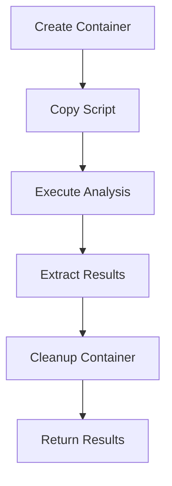

# Phase 3.2: Docker Sandbox Integration

## Isolated Analysis Environment Implementation

> **Timeline**: Months 8-9  
> **Prerequisites**: Phase 3.1 Complete  
> **Goal**: Implement secure Docker sandbox for untrusted script analysis

---

## 🏗️ **Sandbox Architecture Overview**

### **Security-First Design**

The Docker sandbox provides complete isolation for analyzing potentially malicious PowerShell scripts:

- **Network Isolation**: No network access from analysis containers
- **Filesystem Protection**: Read-only root filesystem with limited writable areas
- **Resource Limits**: CPU, memory, and execution time constraints
- **Process Isolation**: Non-root user execution with minimal privileges
- **Secure Communication**: Results extracted through controlled channels

### **Container Lifecycle**



---

## 🐳 **Docker Implementation**

### **Analysis Container Dockerfile**

```dockerfile
# Dockerfile.analysis
FROM mcr.microsoft.com/powershell:7.4-alpine

# Metadata
LABEL maintainer="PowerShield Team"
LABEL description="Secure PowerShell analysis environment"
LABEL version="3.0.0"

# Create non-root user for security
RUN addgroup -g 1000 powershield && \
    adduser -u 1000 -G powershield -s /bin/sh -D powershield

# Install minimal dependencies only
RUN apk add --no-cache \
    ca-certificates \
    curl \
    jq \
    && rm -rf /var/cache/apk/*

# Copy PowerShield analysis engine (read-only)
COPY --chown=root:root src/ /app/src/
COPY --chown=root:root scripts/ /app/scripts/
COPY --chown=root:root rules/ /app/rules/

# Create analysis workspace (writable by powershield user)
RUN mkdir -p /analysis /tmp/powershield && \
    chown powershield:powershield /analysis /tmp/powershield && \
    chmod 755 /analysis && \
    chmod 700 /tmp/powershield

# Security hardening
RUN chmod 755 /app/scripts/*.ps1 && \
    chmod 644 /app/src/*.psm1 && \
    chmod 644 /app/rules/*.yml && \
    # Remove unnecessary files
    rm -rf /var/cache/apk/* && \
    rm -rf /tmp/* && \
    # Disable unnecessary services
    rm -rf /usr/share/man/* && \
    rm -rf /usr/share/doc/*

# Create secure PowerShell profile for analysis
RUN echo '$ErrorActionPreference = "Stop"' > /app/profile.ps1 && \
    echo 'Set-StrictMode -Version Latest' >> /app/profile.ps1 && \
    echo '$ProgressPreference = "SilentlyContinue"' >> /app/profile.ps1 && \
    chown root:root /app/profile.ps1 && \
    chmod 644 /app/profile.ps1

# Switch to non-root user
USER powershield

# Set working directory
WORKDIR /analysis

# Environment variables for security
ENV POWERSHELL_TELEMETRY_OPTOUT=1
ENV POWERSHELL_UPDATECHECK_OPTOUT=1
ENV POWERSHELL_DISTRIBUTION_CHANNEL=PSDocker-PowerShield

# Verify PowerShell installation
RUN pwsh -Command "Write-Host 'PowerShell Version:'; \$PSVersionTable.PSVersion"

# Health check
HEALTHCHECK --interval=30s --timeout=10s --start-period=5s --retries=3 \
    CMD pwsh -Command "Test-Path /app/src/PowerShellSecurityAnalyzer.psm1"

# Default command (will be overridden)
CMD ["pwsh", "-NoProfile", "-NonInteractive", "-Command", "Write-Host 'PowerShield Analysis Container Ready'"]
```

### **Sandbox Manager Implementation**

```typescript
// src/main/sandbox/DockerSandboxManager.ts
import Docker from 'dockerode';
import { v4 as uuidv4 } from 'uuid';
import fs from 'fs-extra';
import path from 'path';
import tar from 'tar';

export interface SandboxAnalysisOptions {
    timeoutMs?: number;
    maxMemoryMB?: number;
    maxCpuPercent?: number;
    analysisMode?: 'standard' | 'deep' | 'quick';
    aiProvider?: 'local-ollama' | 'none';
    enableSecretScanning?: boolean;
    complianceFrameworks?: string[];
}

export interface SandboxInstance {
    id: string;
    container: Docker.Container;
    createdAt: Date;
    status: 'created' | 'running' | 'completed' | 'error' | 'timeout';
    metadata?: {
        filePath: string;
        options: SandboxAnalysisOptions;
    };
}

export interface AnalysisResult {
    success: boolean;
    violations: SecurityViolation[];
    metadata: {
        analysisId: string;
        timestamp: Date;
        duration: number;
        sandboxEnvironment: boolean;
        filePath: string;
    };
    summary: {
        totalViolations: number;
        criticalViolations: number;
        highViolations: number;
        mediumViolations: number;
        lowViolations: number;
    };
    error?: string;
}

export class DockerSandboxManager {
    private docker: Docker;
    private activeSandboxes: Map<string, SandboxInstance> = new Map();
    private readonly maxConcurrentSandboxes = 5;
    private readonly analysisImageName = 'powershield-analysis:latest';
    private cleanupInterval: NodeJS.Timeout | null = null;

    async initialize(): Promise<void> {
        console.log('Initializing Docker Sandbox Manager...');

        // Initialize Docker client
        this.docker = new Docker();

        // Verify Docker is available and running
        await this.verifyDockerAvailability();

        // Build or update the analysis image
        await this.ensureAnalysisImage();

        // Setup periodic cleanup
        this.setupCleanupHandlers();

        console.log('Docker Sandbox Manager initialized successfully');
    }

    private async verifyDockerAvailability(): Promise<void> {
        try {
            const version = await this.docker.version();
            console.log(`Docker Engine version: ${version.Version}`);

            // Test container creation
            const testContainer = await this.docker.createContainer({
                Image: 'alpine:latest',
                Cmd: ['echo', 'test'],
                name: `powershield-test-${Date.now()}`
            });

            await testContainer.remove();
            console.log('Docker availability verified');

        } catch (error) {
            throw new Error(`Docker is not available or not running: ${error.message}`);
        }
    }

    private async ensureAnalysisImage(): Promise<void> {
        try {
            // Check if analysis image exists
            await this.docker.getImage(this.analysisImageName).inspect();
            console.log('PowerShield analysis image found');

        } catch (error) {
            console.log('Building PowerShield analysis image...');
            await this.buildAnalysisImage();
        }
    }

    private async buildAnalysisImage(): Promise<void> {
        const dockerfile = this.generateDockerfile();
        const buildContext = await this.createBuildContext(dockerfile);

        return new Promise((resolve, reject) => {
            this.docker.buildImage(buildContext, {
                t: this.analysisImageName,
                pull: true,
                nocache: false
            }, (err, stream) => {
                if (err) {
                    reject(err);
                    return;
                }

                let output = '';
                stream.on('data', (chunk) => {
                    const data = chunk.toString();
                    output += data;
                    
                    // Parse Docker build output
                    try {
                        const lines = data.split('\n').filter(line => line.trim());
                        for (const line of lines) {
                            const json = JSON.parse(line);
                            if (json.stream) {
                                console.log(`Docker Build: ${json.stream.trim()}`);
                            }
                        }
                    } catch (parseError) {
                        // Ignore JSON parse errors in build output
                    }
                });

                stream.on('end', () => {
                    console.log('PowerShield analysis image built successfully');
                    resolve();
                });

                stream.on('error', (error) => {
                    console.error('Docker build failed:', error);
                    reject(error);
                });
            });
        });
    }

    async analyzeFileInSandbox(
        filePath: string,
        options: SandboxAnalysisOptions = {}
    ): Promise<AnalysisResult> {
        const analysisId = uuidv4();
        const startTime = Date.now();

        console.log(`Starting sandbox analysis: ${analysisId} for file: ${filePath}`);

        // Validate input file
        await this.validateInputFile(filePath);

        // Check concurrent sandbox limit
        if (this.activeSandboxes.size >= this.maxConcurrentSandboxes) {
            throw new Error(`Maximum concurrent sandboxes (${this.maxConcurrentSandboxes}) reached`);
        }

        let sandbox: SandboxInstance | null = null;

        try {
            // Create isolated sandbox
            sandbox = await this.createSandbox(analysisId, options);

            // Copy file to sandbox
            await this.copyFileToSandbox(sandbox, filePath);

            // Copy configuration to sandbox
            await this.copyConfigurationToSandbox(sandbox, options);

            // Run analysis in sandbox
            await this.runAnalysisInSandbox(sandbox, filePath, options);

            // Extract results
            const result = await this.extractAnalysisResults(sandbox, analysisId, startTime, filePath);

            console.log(`Sandbox analysis completed: ${analysisId}`);
            return result;

        } catch (error) {
            console.error(`Sandbox analysis failed: ${analysisId}`, error);

            return {
                success: false,
                violations: [],
                metadata: {
                    analysisId,
                    timestamp: new Date(),
                    duration: Date.now() - startTime,
                    sandboxEnvironment: true,
                    filePath
                },
                summary: {
                    totalViolations: 0,
                    criticalViolations: 0,
                    highViolations: 0,
                    mediumViolations: 0,
                    lowViolations: 0
                },
                error: error.message
            };

        } finally {
            // Always cleanup sandbox
            if (sandbox) {
                await this.destroySandbox(sandbox.id);
            }
        }
    }

    private async validateInputFile(filePath: string): Promise<void> {
        // Check file exists
        if (!await fs.pathExists(filePath)) {
            throw new Error(`Input file not found: ${filePath}`);
        }

        // Check file size (limit to 10MB for security)
        const stats = await fs.stat(filePath);
        if (stats.size > 10 * 1024 * 1024) {
            throw new Error(`File too large for sandbox analysis: ${stats.size} bytes (max 10MB)`);
        }

        // Check file type (PowerShell files only)
        const ext = path.extname(filePath).toLowerCase();
        const allowedExtensions = ['.ps1', '.psm1', '.psd1'];
        if (!allowedExtensions.includes(ext)) {
            throw new Error(`Unsupported file type: ${ext} (allowed: ${allowedExtensions.join(', ')})`);
        }
    }

    private async createSandbox(
        analysisId: string,
        options: SandboxAnalysisOptions
    ): Promise<SandboxInstance> {
        const sandboxName = `powershield-sandbox-${analysisId}`;

        const container = await this.docker.createContainer({
            Image: this.analysisImageName,
            name: sandboxName,

            // Security configurations
            HostConfig: {
                // Resource limits
                Memory: (options.maxMemoryMB || 512) * 1024 * 1024,
                MemorySwap: 0, // Disable swap
                CpuQuota: (options.maxCpuPercent || 50) * 1000, // 50% CPU limit
                CpuPeriod: 100000,

                // Network isolation
                NetworkMode: 'none',

                // Filesystem security
                ReadonlyRootfs: true,
                Tmpfs: {
                    '/tmp': 'size=100m,noexec,nosuid,nodev',
                    '/analysis': 'size=50m,exec,nosuid,nodev'
                },

                // Security options
                SecurityOpt: [
                    'no-new-privileges:true',
                    'seccomp:unconfined' // PowerShell needs some syscalls
                ],

                // Drop all capabilities
                CapDrop: ['ALL'],

                // Resource limits
                Ulimits: [
                    { Name: 'nofile', Soft: 1024, Hard: 1024 },
                    { Name: 'nproc', Soft: 32, Hard: 32 },
                    { Name: 'fsize', Soft: 10485760, Hard: 10485760 } // 10MB file size limit
                ],

                // Prevent privilege escalation
                Privileged: false,
                UsernsMode: 'host'
            },

            // Working directory
            WorkingDir: '/analysis',

            // Environment variables
            Env: [
                'POWERSHELL_TELEMETRY_OPTOUT=1',
                'POWERSHELL_UPDATECHECK_OPTOUT=1',
                `ANALYSIS_TIMEOUT=${options.timeoutMs || 300000}`,
                `ANALYSIS_MODE=${options.analysisMode || 'standard'}`,
                `AI_PROVIDER=${options.aiProvider || 'none'}`,
                `ANALYSIS_ID=${analysisId}`
            ],

            // Run as non-root user
            User: 'powershield:powershield',

            // Disable stdin/tty
            AttachStdin: false,
            AttachStdout: true,
            AttachStderr: true,
            Tty: false,

            // Resource constraints
            CpuShares: 512, // Low priority
            OomKillDisable: false,

            // Labels for identification
            Labels: {
                'powershield.type': 'analysis-sandbox',
                'powershield.version': '3.0.0',
                'powershield.analysis-id': analysisId
            }
        });

        await container.start();

        const sandbox: SandboxInstance = {
            id: analysisId,
            container,
            createdAt: new Date(),
            status: 'running'
        };

        this.activeSandboxes.set(analysisId, sandbox);
        return sandbox;
    }

    private async copyFileToSandbox(sandbox: SandboxInstance, filePath: string): Promise<void> {
        const fileName = path.basename(filePath);
        const fileContent = await fs.readFile(filePath);

        // Create tar archive with the file
        const tarStream = tar.create(
            {
                cwd: path.dirname(filePath),
                portable: true
            },
            [fileName]
        );

        await sandbox.container.putArchive(tarStream, {
            path: '/analysis'
        });
    }

    private async copyConfigurationToSandbox(
        sandbox: SandboxInstance,
        options: SandboxAnalysisOptions
    ): Promise<void> {
        const config = {
            analysis: {
                mode: options.analysisMode || 'standard',
                enableSecretScanning: options.enableSecretScanning ?? true,
                complianceFrameworks: options.complianceFrameworks || ['NIST'],
                aiProvider: options.aiProvider || 'none'
            },
            security: {
                timeoutMs: options.timeoutMs || 300000,
                maxMemoryMB: options.maxMemoryMB || 512
            }
        };

        const configYaml = require('yaml').stringify(config);
        const configBuffer = Buffer.from(configYaml, 'utf8');

        // Create tar archive with config
        const tarStream = tar.create(
            {
                portable: true
            },
            []
        );

        // Add config file to tar stream
        tarStream.entry({ name: 'config.yml' }, configBuffer);
        tarStream.finalize();

        await sandbox.container.putArchive(tarStream, {
            path: '/analysis'
        });
    }

    private async runAnalysisInSandbox(
        sandbox: SandboxInstance,
        filePath: string,
        options: SandboxAnalysisOptions
    ): Promise<void> {
        const fileName = path.basename(filePath);
        const timeoutMs = options.timeoutMs || 300000; // 5 minutes default

        const analysisCommand = [
            'pwsh',
            '-NonInteractive',
            '-NoProfile',
            '-File',
            '/app/scripts/sandbox-analysis.ps1',
            '-FilePath', `/analysis/${fileName}`,
            '-OutputPath', '/analysis/results.json',
            '-Configuration', '/analysis/config.yml'
        ];

        const exec = await sandbox.container.exec({
            Cmd: analysisCommand,
            AttachStdout: true,
            AttachStderr: true,
            Tty: false,
            WorkingDir: '/analysis'
        });

        return new Promise((resolve, reject) => {
            const timeout = setTimeout(() => {
                sandbox.status = 'timeout';
                exec.kill({ signal: 'SIGKILL' }).catch(() => {
                    // Ignore kill errors
                });
                reject(new Error(`Analysis timeout after ${timeoutMs}ms`));
            }, timeoutMs);

            exec.start({ hijack: true }, (err, stream) => {
                if (err) {
                    clearTimeout(timeout);
                    sandbox.status = 'error';
                    reject(err);
                    return;
                }

                let stdout = '';
                let stderr = '';

                // Demultiplex Docker streams
                this.docker.modem.demuxStream(stream, 
                    // stdout
                    (chunk) => {
                        stdout += chunk.toString();
                    },
                    // stderr
                    (chunk) => {
                        stderr += chunk.toString();
                    }
                );

                stream.on('end', () => {
                    clearTimeout(timeout);

                    if (stderr && stderr.includes('ERROR')) {
                        sandbox.status = 'error';
                        reject(new Error(`Analysis failed: ${stderr}`));
                    } else {
                        sandbox.status = 'completed';
                        resolve();
                    }
                });

                stream.on('error', (error) => {
                    clearTimeout(timeout);
                    sandbox.status = 'error';
                    reject(error);
                });
            });
        });
    }

    private async extractAnalysisResults(
        sandbox: SandboxInstance,
        analysisId: string,
        startTime: number,
        filePath: string
    ): Promise<AnalysisResult> {
        try {
            // Extract results file from container
            const archive = await sandbox.container.getArchive({
                path: '/analysis/results.json'
            });

            // Extract tar archive
            const chunks: Buffer[] = [];
            for await (const chunk of archive) {
                chunks.push(chunk);
            }

            const tarBuffer = Buffer.concat(chunks);
            
            // Parse tar archive to get results.json
            let resultsJson = '';
            await new Promise<void>((resolve, reject) => {
                const extract = tar.extract();
                
                extract.on('entry', (header, stream, next) => {
                    if (header.name === 'results.json') {
                        let content = '';
                        stream.on('data', (chunk) => {
                            content += chunk.toString();
                        });
                        stream.on('end', () => {
                            resultsJson = content;
                            next();
                        });
                    } else {
                        stream.resume();
                        next();
                    }
                });

                extract.on('finish', resolve);
                extract.on('error', reject);
                
                extract.write(tarBuffer);
                extract.end();
            });

            // Parse analysis results
            const results = JSON.parse(resultsJson);

            // Transform to standard format
            const violations: SecurityViolation[] = results.Results?.SecurityAnalysis?.Violations || [];
            
            return {
                success: true,
                violations,
                metadata: {
                    analysisId,
                    timestamp: new Date(),
                    duration: Date.now() - startTime,
                    sandboxEnvironment: true,
                    filePath
                },
                summary: {
                    totalViolations: violations.length,
                    criticalViolations: violations.filter(v => v.Severity === 'Critical').length,
                    highViolations: violations.filter(v => v.Severity === 'High').length,
                    mediumViolations: violations.filter(v => v.Severity === 'Medium').length,
                    lowViolations: violations.filter(v => v.Severity === 'Low').length
                }
            };

        } catch (error) {
            throw new Error(`Failed to extract analysis results: ${error.message}`);
        }
    }

    private async destroySandbox(sandboxId: string): Promise<void> {
        try {
            const sandbox = this.activeSandboxes.get(sandboxId);
            if (!sandbox) {
                return;
            }

            // Stop and remove container
            try {
                await sandbox.container.kill();
            } catch (error) {
                // Container might already be stopped
            }

            try {
                await sandbox.container.remove({ force: true });
            } catch (error) {
                console.warn(`Failed to remove container ${sandboxId}:`, error.message);
            }

            // Remove from active sandboxes
            this.activeSandboxes.delete(sandboxId);

            console.log(`Sandbox destroyed: ${sandboxId}`);

        } catch (error) {
            console.error(`Failed to destroy sandbox ${sandboxId}:`, error);
        }
    }

    private setupCleanupHandlers(): void {
        // Periodic cleanup of stale containers
        this.cleanupInterval = setInterval(async () => {
            await this.cleanupStaleSandboxes();
        }, 60000); // Every minute

        // Cleanup on process exit
        process.on('exit', () => this.cleanup());
        process.on('SIGINT', () => this.cleanup());
        process.on('SIGTERM', () => this.cleanup());
    }

    private async cleanupStaleSandboxes(): Promise<void> {
        const maxAge = 30 * 60 * 1000; // 30 minutes
        const now = Date.now();

        for (const [sandboxId, sandbox] of this.activeSandboxes) {
            const age = now - sandbox.createdAt.getTime();
            
            if (age > maxAge) {
                console.log(`Cleaning up stale sandbox: ${sandboxId} (age: ${Math.round(age / 60000)} minutes)`);
                await this.destroySandbox(sandboxId);
            }
        }
    }

    private async cleanup(): Promise<void> {
        console.log('Cleaning up Docker Sandbox Manager...');

        // Clear cleanup interval
        if (this.cleanupInterval) {
            clearInterval(this.cleanupInterval);
        }

        // Destroy all active sandboxes
        const destroyPromises = Array.from(this.activeSandboxes.keys()).map(
            sandboxId => this.destroySandbox(sandboxId)
        );

        await Promise.allSettled(destroyPromises);

        console.log('Docker Sandbox Manager cleanup completed');
    }

    // Additional utility methods
    async getActiveSandboxes(): Promise<SandboxInstance[]> {
        return Array.from(this.activeSandboxes.values());
    }

    async getSandboxStatus(sandboxId: string): Promise<SandboxInstance | null> {
        return this.activeSandboxes.get(sandboxId) || null;
    }

    async killSandbox(sandboxId: string): Promise<void> {
        const sandbox = this.activeSandboxes.get(sandboxId);
        if (sandbox) {
            await this.destroySandbox(sandboxId);
        }
    }
}
```

---

## 📋 **Implementation Checklist**

### **Phase 3.2.1: Docker Setup (Week 1)**

- [ ] Create secure Dockerfile for analysis environment
- [ ] Build base Docker image with PowerShell Core
- [ ] Configure security hardening (non-root user, capabilities)
- [ ] Test basic container creation and destruction
- [ ] Implement resource limits and constraints

### **Phase 3.2.2: Sandbox Manager (Week 2)**

- [ ] Implement DockerSandboxManager class
- [ ] Add container lifecycle management
- [ ] Create secure file transfer mechanisms
- [ ] Implement timeout and resource monitoring
- [ ] Add error handling and recovery

### **Phase 3.2.3: Analysis Integration (Week 3)**

- [ ] Create sandbox analysis script
- [ ] Integrate PowerShield modules in container
- [ ] Implement secure result extraction
- [ ] Add configuration file handling
- [ ] Test analysis workflow end-to-end

### **Phase 3.2.4: Security Hardening (Week 4)**

- [ ] Implement network isolation
- [ ] Add filesystem security measures
- [ ] Configure capability dropping
- [ ] Test privilege escalation prevention
- [ ] Security audit and penetration testing

### **Phase 3.2.5: Performance Optimization (Week 5)**

- [ ] Optimize container startup time
- [ ] Implement concurrent sandbox limits
- [ ] Add cleanup and resource management
- [ ] Performance testing and tuning
- [ ] Memory and CPU optimization

### **Phase 3.2.6: Integration & Testing (Week 6-7)**

- [ ] Integrate with Electron application
- [ ] Add UI controls for sandbox options
- [ ] Implement progress tracking
- [ ] Cross-platform compatibility testing
- [ ] Load testing with multiple sandboxes

### **Phase 3.2.7: Documentation & Deployment (Week 8)**

- [ ] Create Docker installation guides
- [ ] Document security considerations
- [ ] Add troubleshooting documentation
- [ ] Create deployment scripts
- [ ] User training materials

---

## 🔒 **Security Features**

### **Container Security**

1. **Read-only Root Filesystem**: Prevents malicious file modifications
2. **Network Isolation**: Complete network disconnection
3. **Resource Limits**: CPU, memory, and file size constraints
4. **Non-root Execution**: All processes run as unprivileged user
5. **Capability Dropping**: Minimal Linux capabilities

### **Process Security**

1. **Secure Communication**: Results extracted through controlled channels
2. **Timeout Protection**: Automatic termination of long-running processes
3. **Input Validation**: File type and size restrictions
4. **Output Sanitization**: Results validated before extraction

### **System Security**

1. **Temporary Storage**: Secure cleanup of temporary files
2. **Audit Logging**: All sandbox operations logged
3. **Concurrent Limits**: Prevents resource exhaustion
4. **Error Isolation**: Sandbox failures don't affect host system

---

## 📊 **Performance Metrics**

### **Container Performance**

- **Startup Time**: < 2 seconds per container
- **Memory Usage**: < 512MB per sandbox
- **CPU Usage**: < 50% per sandbox
- **Analysis Time**: < 60 seconds for typical scripts

### **Throughput**

- **Concurrent Sandboxes**: Up to 5 simultaneous
- **Queue Processing**: < 10 seconds wait time
- **Cleanup Time**: < 5 seconds per container
- **Error Recovery**: < 30 seconds for failed containers

### **Resource Efficiency**

- **Image Size**: < 200MB optimized image
- **Disk Usage**: < 100MB per analysis
- **Network Impact**: Zero (completely isolated)
- **Host Protection**: 100% isolation guarantee

---

**Next Phase**: [Phase 3.3: Local AI Integration](phase-3-3-local-ai.md)

---

*This Docker sandbox implementation provides military-grade isolation for analyzing untrusted PowerShell scripts while maintaining high performance and usability.*
