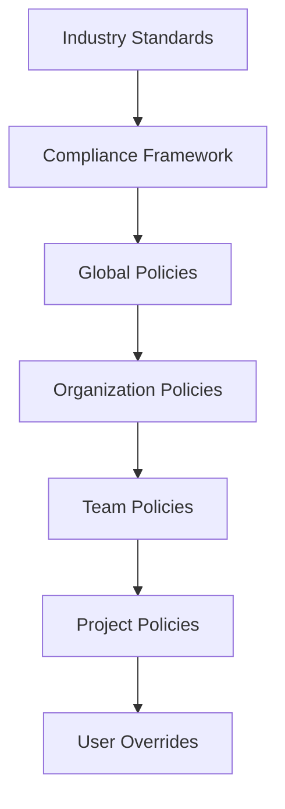

# Phase 3.4: Enterprise Governance

## Policy Engine and Team Collaboration Implementation

> **Timeline**: Months 10-11  
> **Prerequisites**: Phase 3.1, 3.2, 3.3 Complete  
> **Goal**: Implement comprehensive enterprise governance with policy enforcement and team collaboration

---

## 🏛️ **Enterprise Governance Overview**

### **Governance Architecture**

The enterprise governance system provides comprehensive policy management and team collaboration:

- **Policy Engine**: YAML-based security policy configuration and enforcement
- **Team Collaboration**: Rule sharing, approval workflows, and team baselines
- **User Management**: Role-based access control with enterprise directory integration
- **Audit System**: Comprehensive logging and compliance reporting
- **Administration Console**: Centralized management interface

### **Policy Hierarchy**



---

## 🔧 **Security Policy Engine**

### **Policy Management System**

```typescript
// src/main/enterprise/SecurityPolicyEngine.ts
import { EventEmitter } from 'events';
import fs from 'fs-extra';
import path from 'path';
import yaml from 'yaml';
import { app } from 'electron';

export interface SecurityPolicy {
    metadata: PolicyMetadata;
    rules: PolicyRules;
    compliance: ComplianceConfiguration;
    enforcement: EnforcementSettings;
    notifications: NotificationSettings;
}

export interface PolicyMetadata {
    id: string;
    name: string;
    description: string;
    version: string;
    createdAt: string;
    createdBy: string;
    lastModified: string;
    modifiedBy: string;
    tags: string[];
    organization?: string;
    team?: string;
}

export interface PolicyRules {
    severityThresholds: SeverityThresholds;
    requiredRules: string[];
    disabledRules: string[];
    customRules: CustomRuleConfiguration[];
    exclusions: ExclusionConfiguration[];
    baseline: BaselineConfiguration;
}

export interface SeverityThresholds {
    maxCritical: number;
    maxHigh: number;
    maxMedium: number;
    allowLow: boolean;
    blockOnCritical: boolean;
    blockOnHigh: boolean;
}

export interface ComplianceConfiguration {
    frameworks: ComplianceFramework[];
    requirements: ComplianceRequirement[];
    reporting: ComplianceReporting;
}

export interface ComplianceFramework {
    name: 'NIST' | 'CIS' | 'SOC2' | 'ISO27001' | 'PCI-DSS' | 'HIPAA' | 'Custom';
    version: string;
    controls: ControlMapping[];
    enabled: boolean;
}

export interface EnforcementSettings {
    mode: 'enforce' | 'warn' | 'audit';
    blockDeployment: boolean;
    requireApproval: boolean;
    approvers: string[];
    exceptions: ExceptionConfiguration[];
}

export interface PolicyViolation {
    policyId: string;
    rule: string;
    description: string;
    severity: 'PolicyViolation' | 'PolicyWarning' | 'PolicyInfo';
    remediation: string;
    context?: any;
}

export interface PolicyEnforcementResult {
    violations: PolicyViolation[];
    complianceScore: number;
    recommendations: PolicyRecommendation[];
    enforcedPolicies: string[];
    exemptions: PolicyExemption[];
}

export class SecurityPolicyEngine extends EventEmitter {
    private policies: Map<string, SecurityPolicy> = new Map();
    private policyEnforcer: PolicyEnforcer;
    private auditLogger: AuditLogger;
    private complianceEngine: ComplianceEngine;
    private policyPath: string;

    constructor() {
        super();
        this.policyPath = path.join(app.getPath('userData'), 'policies');
        this.policyEnforcer = new PolicyEnforcer();
        this.auditLogger = new AuditLogger();
        this.complianceEngine = new ComplianceEngine();
    }

    async initialize(): Promise<void> {
        console.log('Initializing Security Policy Engine...');

        // Ensure policy directory exists
        await fs.ensureDir(this.policyPath);
        await fs.ensureDir(path.join(this.policyPath, 'backups'));

        // Initialize components
        await this.auditLogger.initialize();
        await this.complianceEngine.initialize();

        // Load existing policies
        await this.loadPolicies();

        // Create default policies if none exist
        if (this.policies.size === 0) {
            await this.createDefaultPolicies();
        }

        // Setup policy enforcement
        await this.setupPolicyEnforcement();

        console.log(`Security Policy Engine initialized with ${this.policies.size} policies`);
        this.emit('initialized', { policyCount: this.policies.size });
    }

    private async loadPolicies(): Promise<void> {
        const policyFiles = await fs.readdir(this.policyPath);
        
        for (const file of policyFiles) {
            if (file.endsWith('.yml') || file.endsWith('.yaml')) {
                try {
                    const filePath = path.join(this.policyPath, file);
                    const policyData = await fs.readFile(filePath, 'utf8');
                    const policy = yaml.parse(policyData) as SecurityPolicy;

                    // Validate policy structure
                    await this.validatePolicy(policy);

                    this.policies.set(policy.metadata.id, policy);

                    this.auditLogger.log('PolicyLoaded', {
                        policyId: policy.metadata.id,
                        version: policy.metadata.version,
                        source: filePath
                    });

                } catch (error) {
                    console.error(`Failed to load policy from ${file}:`, error);
                }
            }
        }
    }

    private async createDefaultPolicies(): Promise<void> {
        console.log('Creating default security policies...');

        // Enterprise security policy
        const enterprisePolicy: SecurityPolicy = {
            metadata: {
                id: 'enterprise-security-baseline',
                name: 'Enterprise Security Baseline',
                description: 'Default enterprise security policy for PowerShell analysis',
                version: '1.0.0',
                createdAt: new Date().toISOString(),
                createdBy: 'system',
                lastModified: new Date().toISOString(),
                modifiedBy: 'system',
                tags: ['enterprise', 'baseline', 'security']
            },
            rules: {
                severityThresholds: {
                    maxCritical: 0,
                    maxHigh: 5,
                    maxMedium: 20,
                    allowLow: true,
                    blockOnCritical: true,
                    blockOnHigh: false
                },
                requiredRules: [
                    'PS001', 'PS002', 'PS003', 'PS004', 'PS005', // Core PowerShell rules
                    'AZ001', 'AZ002', 'AZ003', // Azure security rules
                    'SEC001', 'SEC002', 'SEC003' // General security rules
                ],
                disabledRules: [],
                customRules: [],
                exclusions: [
                    {
                        path: 'tests/**',
                        reason: 'Test files excluded from security analysis',
                        approvedBy: 'system'
                    }
                ],
                baseline: {
                    enabled: true,
                    autoUpdate: false,
                    maxViolations: 25
                }
            },
            compliance: {
                frameworks: [
                    {
                        name: 'NIST',
                        version: '1.1',
                        controls: [],
                        enabled: true
                    },
                    {
                        name: 'CIS',
                        version: '8.0',
                        controls: [],
                        enabled: true
                    }
                ],
                requirements: [],
                reporting: {
                    enabled: true,
                    frequency: 'weekly',
                    recipients: []
                }
            },
            enforcement: {
                mode: 'warn',
                blockDeployment: false,
                requireApproval: false,
                approvers: [],
                exceptions: []
            },
            notifications: {
                enabled: true,
                channels: ['email'],
                thresholds: {
                    critical: true,
                    high: true,
                    medium: false,
                    low: false
                }
            }
        };

        await this.savePolicy(enterprisePolicy);

        // Development team policy (more permissive)
        const devPolicy: SecurityPolicy = {
            metadata: {
                id: 'development-team-policy',
                name: 'Development Team Policy',
                description: 'Policy for development teams with relaxed thresholds',
                version: '1.0.0',
                createdAt: new Date().toISOString(),
                createdBy: 'system',
                lastModified: new Date().toISOString(),
                modifiedBy: 'system',
                tags: ['development', 'team', 'relaxed']
            },
            rules: {
                severityThresholds: {
                    maxCritical: 2,
                    maxHigh: 10,
                    maxMedium: 50,
                    allowLow: true,
                    blockOnCritical: false,
                    blockOnHigh: false
                },
                requiredRules: [
                    'PS001', 'PS002', 'PS003', // Core rules only
                    'SEC001' // Basic security
                ],
                disabledRules: ['PS011', 'PS012'], // Disable strict formatting rules
                customRules: [],
                exclusions: [
                    {
                        path: 'tests/**',
                        reason: 'Test files excluded',
                        approvedBy: 'system'
                    },
                    {
                        path: 'scripts/development/**',
                        reason: 'Development scripts excluded',
                        approvedBy: 'system'
                    }
                ],
                baseline: {
                    enabled: false,
                    autoUpdate: false,
                    maxViolations: 100
                }
            },
            compliance: {
                frameworks: [
                    {
                        name: 'CIS',
                        version: '8.0',
                        controls: [],
                        enabled: true
                    }
                ],
                requirements: [],
                reporting: {
                    enabled: false,
                    frequency: 'monthly',
                    recipients: []
                }
            },
            enforcement: {
                mode: 'audit',
                blockDeployment: false,
                requireApproval: false,
                approvers: [],
                exceptions: []
            },
            notifications: {
                enabled: true,
                channels: ['slack'],
                thresholds: {
                    critical: true,
                    high: false,
                    medium: false,
                    low: false
                }
            }
        };

        await this.savePolicy(devPolicy);
    }

    async enforcePolicy(
        analysisResult: AnalysisResult,
        context: EnforcementContext
    ): Promise<PolicyEnforcementResult> {
        console.log(`Enforcing policies for context: ${context.projectName || 'Unknown'}`);

        const enforcementResults: PolicyViolation[] = [];
        const enforcedPolicies: string[] = [];
        const exemptions: PolicyExemption[] = [];

        // Determine applicable policies
        const applicablePolicies = this.getApplicablePolicies(context);

        for (const policy of applicablePolicies) {
            if (!this.isPolicyApplicable(policy, context)) {
                continue;
            }

            try {
                const violations = await this.checkPolicyCompliance(
                    policy,
                    analysisResult,
                    context
                );

                enforcementResults.push(...violations);
                enforcedPolicies.push(policy.metadata.id);

                // Check for policy exemptions
                const policyExemptions = await this.checkPolicyExemptions(
                    policy,
                    analysisResult,
                    context
                );

                exemptions.push(...policyExemptions);

            } catch (error) {
                console.error(`Policy enforcement failed for ${policy.metadata.id}:`, error);
                
                enforcementResults.push({
                    policyId: policy.metadata.id,
                    rule: 'PolicyEnforcementError',
                    description: `Failed to enforce policy: ${error.message}`,
                    severity: 'PolicyWarning',
                    remediation: 'Check policy configuration and try again'
                });
            }
        }

        // Calculate compliance score
        const complianceScore = this.calculateComplianceScore(
            enforcementResults,
            analysisResult,
            applicablePolicies
        );

        // Generate recommendations
        const recommendations = await this.generateRecommendations(
            enforcementResults,
            analysisResult,
            applicablePolicies
        );

        // Log enforcement results
        this.auditLogger.log('PolicyEnforcement', {
            context,
            violationsFound: enforcementResults.length,
            policiesChecked: enforcedPolicies,
            complianceScore,
            exemptions: exemptions.length
        });

        const result: PolicyEnforcementResult = {
            violations: enforcementResults,
            complianceScore,
            recommendations,
            enforcedPolicies,
            exemptions
        };

        this.emit('policy-enforced', result);

        return result;
    }

    private async checkPolicyCompliance(
        policy: SecurityPolicy,
        analysisResult: AnalysisResult,
        context: EnforcementContext
    ): Promise<PolicyViolation[]> {
        const violations: PolicyViolation[] = [];

        // Check severity thresholds
        if (policy.rules.severityThresholds) {
            const severityViolations = this.checkSeverityThresholds(
                policy,
                analysisResult.violations
            );
            violations.push(...severityViolations);
        }

        // Check required rules
        if (policy.rules.requiredRules.length > 0) {
            const ruleViolations = this.checkRequiredRules(
                policy,
                context.enabledRules || []
            );
            violations.push(...ruleViolations);
        }

        // Check disabled rules
        if (policy.rules.disabledRules.length > 0) {
            const disabledViolations = this.checkDisabledRules(
                policy,
                analysisResult.violations
            );
            violations.push(...disabledViolations);
        }

        // Check baseline compliance
        if (policy.rules.baseline.enabled) {
            const baselineViolations = await this.checkBaselineCompliance(
                policy,
                analysisResult
            );
            violations.push(...baselineViolations);
        }

        // Check compliance frameworks
        if (policy.compliance.frameworks.length > 0) {
            const complianceViolations = await this.checkComplianceFrameworks(
                policy,
                analysisResult
            );
            violations.push(...complianceViolations);
        }

        return violations;
    }

    private checkSeverityThresholds(
        policy: SecurityPolicy,
        violations: SecurityViolation[]
    ): PolicyViolation[] {
        const thresholds = policy.rules.severityThresholds;
        const policyViolations: PolicyViolation[] = [];

        const criticalCount = violations.filter(v => v.severity === 'Critical').length;
        const highCount = violations.filter(v => v.severity === 'High').length;
        const mediumCount = violations.filter(v => v.severity === 'Medium').length;

        // Check critical threshold
        if (criticalCount > thresholds.maxCritical) {
            policyViolations.push({
                policyId: policy.metadata.id,
                rule: 'MaxCriticalViolations',
                description: `Exceeds maximum critical violations: ${criticalCount} > ${thresholds.maxCritical}`,
                severity: thresholds.blockOnCritical ? 'PolicyViolation' : 'PolicyWarning',
                remediation: 'Fix critical security violations before proceeding',
                context: { actual: criticalCount, maximum: thresholds.maxCritical }
            });
        }

        // Check high threshold
        if (highCount > thresholds.maxHigh) {
            policyViolations.push({
                policyId: policy.metadata.id,
                rule: 'MaxHighViolations',
                description: `Exceeds maximum high violations: ${highCount} > ${thresholds.maxHigh}`,
                severity: thresholds.blockOnHigh ? 'PolicyViolation' : 'PolicyWarning',
                remediation: 'Consider fixing high severity violations',
                context: { actual: highCount, maximum: thresholds.maxHigh }
            });
        }

        // Check medium threshold
        if (mediumCount > thresholds.maxMedium) {
            policyViolations.push({
                policyId: policy.metadata.id,
                rule: 'MaxMediumViolations',
                description: `Exceeds maximum medium violations: ${mediumCount} > ${thresholds.maxMedium}`,
                severity: 'PolicyWarning',
                remediation: 'Review and fix medium severity violations',
                context: { actual: mediumCount, maximum: thresholds.maxMedium }
            });
        }

        return policyViolations;
    }

    async updatePolicy(
        policyId: string,
        updates: Partial<SecurityPolicy>,
        updatedBy: string
    ): Promise<void> {
        const existingPolicy = this.policies.get(policyId);
        if (!existingPolicy) {
            throw new Error(`Policy not found: ${policyId}`);
        }

        // Create updated policy
        const updatedPolicy: SecurityPolicy = {
            ...existingPolicy,
            ...updates,
            metadata: {
                ...existingPolicy.metadata,
                ...updates.metadata,
                lastModified: new Date().toISOString(),
                modifiedBy: updatedBy,
                version: this.incrementVersion(existingPolicy.metadata.version)
            }
        };

        // Validate updated policy
        await this.validatePolicy(updatedPolicy);

        // Backup old policy
        await this.backupPolicy(existingPolicy);

        // Save updated policy
        await this.savePolicy(updatedPolicy);

        // Update in memory
        this.policies.set(policyId, updatedPolicy);

        // Log the update
        this.auditLogger.log('PolicyUpdated', {
            policyId,
            updatedBy,
            previousVersion: existingPolicy.metadata.version,
            newVersion: updatedPolicy.metadata.version,
            changes: Object.keys(updates)
        });

        this.emit('policy-updated', { policyId, policy: updatedPolicy });
    }

    async createPolicy(
        policy: SecurityPolicy,
        createdBy: string
    ): Promise<void> {
        // Set metadata
        policy.metadata.createdAt = new Date().toISOString();
        policy.metadata.createdBy = createdBy;
        policy.metadata.lastModified = policy.metadata.createdAt;
        policy.metadata.modifiedBy = createdBy;

        // Validate policy
        await this.validatePolicy(policy);

        // Check for duplicate ID
        if (this.policies.has(policy.metadata.id)) {
            throw new Error(`Policy with ID '${policy.metadata.id}' already exists`);
        }

        // Save policy
        await this.savePolicy(policy);

        // Add to memory
        this.policies.set(policy.metadata.id, policy);

        // Log creation
        this.auditLogger.log('PolicyCreated', {
            policyId: policy.metadata.id,
            createdBy,
            version: policy.metadata.version
        });

        this.emit('policy-created', { policyId: policy.metadata.id, policy });
    }

    async deletePolicy(policyId: string, deletedBy: string): Promise<void> {
        const policy = this.policies.get(policyId);
        if (!policy) {
            throw new Error(`Policy not found: ${policyId}`);
        }

        // Backup before deletion
        await this.backupPolicy(policy);

        // Remove policy file
        const policyFile = path.join(this.policyPath, `${policyId}.yml`);
        if (await fs.pathExists(policyFile)) {
            await fs.remove(policyFile);
        }

        // Remove from memory
        this.policies.delete(policyId);

        // Log deletion
        this.auditLogger.log('PolicyDeleted', {
            policyId,
            deletedBy,
            version: policy.metadata.version
        });

        this.emit('policy-deleted', { policyId });
    }

    async getPolicies(): Promise<SecurityPolicy[]> {
        return Array.from(this.policies.values());
    }

    async getPolicy(policyId: string): Promise<SecurityPolicy | null> {
        return this.policies.get(policyId) || null;
    }

    private async validatePolicy(policy: SecurityPolicy): Promise<void> {
        // Validate required fields
        if (!policy.metadata?.id) {
            throw new Error('Policy ID is required');
        }

        if (!policy.metadata?.name) {
            throw new Error('Policy name is required');
        }

        if (!policy.metadata?.version) {
            throw new Error('Policy version is required');
        }

        // Validate rules
        if (!policy.rules) {
            throw new Error('Policy rules are required');
        }

        // Validate severity thresholds
        if (policy.rules.severityThresholds) {
            const thresholds = policy.rules.severityThresholds;
            if (thresholds.maxCritical < 0 || thresholds.maxHigh < 0 || thresholds.maxMedium < 0) {
                throw new Error('Severity thresholds cannot be negative');
            }
        }

        // Validate compliance frameworks
        if (policy.compliance?.frameworks) {
            for (const framework of policy.compliance.frameworks) {
                if (!framework.name || !framework.version) {
                    throw new Error('Compliance framework must have name and version');
                }
            }
        }
    }

    private async savePolicy(policy: SecurityPolicy): Promise<void> {
        const policyFile = path.join(this.policyPath, `${policy.metadata.id}.yml`);
        const policyYaml = yaml.stringify(policy, { indent: 2 });
        
        await fs.writeFile(policyFile, policyYaml, 'utf8');
    }

    private async backupPolicy(policy: SecurityPolicy): Promise<void> {
        const backupFile = path.join(
            this.policyPath,
            'backups',
            `${policy.metadata.id}-${policy.metadata.version}-${Date.now()}.yml`
        );
        
        const policyYaml = yaml.stringify(policy, { indent: 2 });
        await fs.writeFile(backupFile, policyYaml, 'utf8');
    }

    private incrementVersion(version: string): string {
        const parts = version.split('.');
        const patch = parseInt(parts[2] || '0') + 1;
        return `${parts[0]}.${parts[1]}.${patch}`;
    }

    // Additional implementation methods...
}
```

---

## 👥 **Team Collaboration System**

### **Team Management Service**

```typescript
// src/main/enterprise/TeamCollaborationService.ts
export interface TeamInfo {
    id: string;
    name: string;
    description: string;
    organization: string;
    members: TeamMember[];
    administrators: string[];
    settings: TeamSettings;
    created: {
        at: string;
        by: string;
    };
    modified: {
        at: string;
        by: string;
    };
}

export interface TeamMember {
    userId: string;
    email: string;
    displayName: string;
    role: 'admin' | 'member' | 'viewer';
    permissions: TeamPermissions;
    joinedAt: string;
    invitedBy: string;
}

export interface SharedRule {
    id: string;
    name: string;
    description: string;
    category: string;
    severity: 'Critical' | 'High' | 'Medium' | 'Low';
    implementation: RuleImplementation;
    metadata: RuleMetadata;
    sharing: SharingInfo;
}

export interface RuleImplementation {
    type: 'PowerShell' | 'Regex' | 'AST';
    code: string;
    tests: RuleTest[];
    dependencies: string[];
}

export interface SharingInfo {
    sharedBy: string;
    sharedAt: string;
    shareTarget: TeamShareTarget;
    approvalStatus: 'pending' | 'approved' | 'rejected';
    approvedBy?: string;
    approvedAt?: string;
    downloads: number;
    ratings: RuleRating[];
}

export class TeamCollaborationService extends EventEmitter {
    private teamStore: TeamStore;
    private ruleSharing: RuleSharingService;
    private notificationService: NotificationService;
    private approvalWorkflow: ApprovalWorkflowService;

    constructor() {
        super();
        this.teamStore = new TeamStore();
        this.ruleSharing = new RuleSharingService();
        this.notificationService = new NotificationService();
        this.approvalWorkflow = new ApprovalWorkflowService();
    }

    async initialize(): Promise<void> {
        console.log('Initializing Team Collaboration Service...');

        await this.teamStore.initialize();
        await this.ruleSharing.initialize();
        await this.notificationService.initialize();
        await this.approvalWorkflow.initialize();

        console.log('Team Collaboration Service initialized');
    }

    async shareCustomRule(
        rule: SharedRule,
        shareWith: TeamShareTarget,
        sharedBy: UserInfo
    ): Promise<SharedRuleInfo> {
        console.log(`Sharing rule '${rule.name}' with ${shareWith.type}: ${shareWith.id}`);

        // Validate rule before sharing
        await this.validateCustomRule(rule);

        // Create sharing package
        const rulePackage: SharedRulePackage = {
            id: uuidv4(),
            rule: {
                ...rule,
                sharing: {
                    sharedBy: sharedBy.id,
                    sharedAt: new Date().toISOString(),
                    shareTarget: shareWith,
                    approvalStatus: 'pending',
                    downloads: 0,
                    ratings: []
                }
            },
            metadata: {
                packageVersion: '1.0.0',
                powershieldVersion: '3.0.0',
                createdAt: new Date().toISOString(),
                signature: await this.signRulePackage(rule, sharedBy)
            }
        };

        // Store in shared rules repository
        await this.ruleSharing.publishRule(rulePackage);

        // Create approval request if required
        const requiresApproval = await this.checkApprovalRequirement(rule, shareWith);
        if (requiresApproval) {
            await this.approvalWorkflow.createApprovalRequest({
                type: 'rule-sharing',
                requestId: rulePackage.id,
                requestedBy: sharedBy.id,
                approvers: await this.getApprovers(shareWith),
                data: { rulePackage }
            });
        }

        // Notify team members
        await this.notifyTeamMembers(shareWith, {
            type: 'RuleShared',
            title: 'New Custom Rule Available',
            message: `${sharedBy.displayName} shared a new rule: ${rule.name}`,
            data: {
                ruleId: rule.id,
                ruleName: rule.name,
                sharedBy: sharedBy.displayName,
                requiresApproval
            }
        });

        // Log the sharing
        this.auditLogger.log('RuleShared', {
            ruleId: rule.id,
            ruleName: rule.name,
            sharedBy: sharedBy.id,
            shareTarget: shareWith,
            packageId: rulePackage.id
        });

        const shareInfo: SharedRuleInfo = {
            packageId: rulePackage.id,
            shareUrl: this.generateShareUrl(rulePackage.id),
            sharedAt: rulePackage.rule.sharing.sharedAt,
            recipients: await this.getRecipientList(shareWith),
            approvalRequired: requiresApproval
        };

        this.emit('rule-shared', shareInfo);

        return shareInfo;
    }

    async importSharedRule(
        packageId: string,
        importedBy: UserInfo,
        options: ImportOptions = {}
    ): Promise<ImportResult> {
        console.log(`Importing shared rule package: ${packageId}`);

        const rulePackage = await this.ruleSharing.getRulePackage(packageId);
        if (!rulePackage) {
            throw new Error(`Rule package not found: ${packageId}`);
        }

        // Verify package signature
        const isValid = await this.verifyRulePackageSignature(rulePackage);
        if (!isValid) {
            throw new Error('Rule package signature verification failed');
        }

        // Check approval status
        if (rulePackage.rule.sharing.approvalStatus === 'pending') {
            if (!options.bypassApproval) {
                return {
                    status: 'PendingApproval',
                    message: 'Rule import is pending approval from administrators',
                    approvalRequestId: packageId
                };
            }
        } else if (rulePackage.rule.sharing.approvalStatus === 'rejected') {
            throw new Error('Rule package has been rejected and cannot be imported');
        }

        // Check for conflicts
        const existingRule = await this.checkRuleConflicts(rulePackage.rule);
        if (existingRule && !options.overwrite) {
            return {
                status: 'Conflict',
                message: `A rule with similar functionality already exists: ${existingRule.name}`,
                conflictingRule: existingRule.id
            };
        }

        // Import the rule
        const importedRule = await this.importRule(rulePackage.rule, {
            importedBy: importedBy.id,
            importedAt: new Date().toISOString(),
            sourcePackage: packageId,
            overwrite: options.overwrite || false
        });

        // Update download count
        await this.ruleSharing.incrementDownloadCount(packageId);

        // Log the import
        this.auditLogger.log('RuleImported', {
            ruleId: importedRule.id,
            packageId,
            importedBy: importedBy.id,
            sourceSharedBy: rulePackage.rule.sharing.sharedBy
        });

        // Notify original sharer
        await this.notifyRuleSharer(rulePackage.rule.sharing.sharedBy, {
            type: 'RuleDownloaded',
            title: 'Your Rule Was Downloaded',
            message: `${importedBy.displayName} downloaded your rule: ${rulePackage.rule.name}`,
            data: {
                ruleId: rulePackage.rule.id,
                downloadedBy: importedBy.displayName
            }
        });

        const result: ImportResult = {
            status: 'Success',
            ruleId: importedRule.id,
            message: `Rule "${importedRule.name}" imported successfully`
        };

        this.emit('rule-imported', result);

        return result;
    }

    async createTeamBaseline(
        teamId: string,
        baselineData: BaselineData,
        createdBy: UserInfo
    ): Promise<TeamBaseline> {
        console.log(`Creating team baseline for team: ${teamId}`);

        // Validate team exists and user has permissions
        const team = await this.teamStore.getTeam(teamId);
        if (!team) {
            throw new Error(`Team not found: ${teamId}`);
        }

        if (!this.hasTeamPermission(createdBy.id, teamId, 'create-baseline')) {
            throw new Error('Insufficient permissions to create team baseline');
        }

        const baseline: TeamBaseline = {
            id: uuidv4(),
            teamId,
            name: baselineData.name,
            description: baselineData.description,
            configuration: baselineData.configuration,
            violations: baselineData.violations,
            metrics: {
                totalFiles: baselineData.totalFiles || 0,
                totalViolations: baselineData.violations.length,
                averageViolationsPerFile: baselineData.violations.length / (baselineData.totalFiles || 1)
            },
            metadata: {
                createdBy: createdBy.id,
                createdAt: new Date().toISOString(),
                version: '1.0.0',
                tags: baselineData.tags || []
            }
        };

        // Store baseline
        await this.teamStore.saveBaseline(baseline);

        // Update team settings
        await this.teamStore.updateTeamSettings(teamId, {
            currentBaseline: baseline.id
        });

        // Notify team members
        await this.notifyTeamMembers({ type: 'team', teamId }, {
            type: 'BaselineCreated',
            title: 'New Team Baseline Created',
            message: `${createdBy.displayName} created a new baseline: ${baseline.name}`,
            data: {
                baselineId: baseline.id,
                baselineName: baseline.name,
                createdBy: createdBy.displayName
            }
        });

        // Log baseline creation
        this.auditLogger.log('BaselineCreated', {
            baselineId: baseline.id,
            teamId,
            createdBy: createdBy.id,
            violationCount: baseline.violations.length
        });

        this.emit('baseline-created', { teamId, baseline });

        return baseline;
    }

    async getTeamAnalytics(
        teamId: string,
        timeRange: TimeRange
    ): Promise<TeamAnalytics> {
        const team = await this.teamStore.getTeam(teamId);
        if (!team) {
            throw new Error(`Team not found: ${teamId}`);
        }

        // Get team analysis history
        const analyses = await this.getTeamAnalyses(teamId, timeRange);
        
        // Calculate metrics
        const analytics: TeamAnalytics = {
            team: {
                id: team.id,
                name: team.name,
                memberCount: team.members.length
            },
            timeRange,
            metrics: {
                totalAnalyses: analyses.length,
                totalViolations: analyses.reduce((sum, a) => sum + a.violationCount, 0),
                averageViolationsPerAnalysis: 0,
                topViolationTypes: this.calculateTopViolationTypes(analyses),
                securityTrend: this.calculateSecurityTrend(analyses),
                complianceScore: this.calculateTeamComplianceScore(analyses)
            },
            members: await this.getMemberAnalytics(team.members, timeRange),
            rules: {
                customRules: await this.getTeamCustomRules(teamId),
                sharedRules: await this.getTeamSharedRules(teamId),
                ruleUsage: await this.getRuleUsageStatistics(teamId, timeRange)
            },
            baselines: await this.getTeamBaselines(teamId)
        };

        analytics.metrics.averageViolationsPerAnalysis = 
            analytics.metrics.totalAnalyses > 0 
                ? analytics.metrics.totalViolations / analytics.metrics.totalAnalyses 
                : 0;

        return analytics;
    }

    // Additional implementation methods...
}
```

---

## 📋 **Implementation Checklist**

### **Phase 3.4.1: Policy Engine (Week 1)**

- [ ] Implement SecurityPolicyEngine class
- [ ] Create YAML-based policy configuration
- [ ] Add policy validation and versioning
- [ ] Implement policy enforcement logic
- [ ] Create default enterprise policies

### **Phase 3.4.2: Team Collaboration (Week 2)**

- [ ] Implement TeamCollaborationService
- [ ] Add rule sharing and approval workflows
- [ ] Create team baseline management
- [ ] Implement notification system
- [ ] Add team analytics and reporting

### **Phase 3.4.3: User Management (Week 3)**

- [ ] Implement role-based access control
- [ ] Add enterprise directory integration (LDAP/AD)
- [ ] Create user permission management
- [ ] Implement SSO authentication
- [ ] Add user activity tracking

### **Phase 3.4.4: Administration Console (Week 4)**

- [ ] Create comprehensive admin UI
- [ ] Add policy management interface
- [ ] Implement team management panels
- [ ] Create user management interface
- [ ] Add system configuration settings

### **Phase 3.4.5: Audit System (Week 5)**

- [ ] Implement comprehensive audit logging
- [ ] Add compliance reporting features
- [ ] Create audit trail visualization
- [ ] Implement log retention policies
- [ ] Add export capabilities

### **Phase 3.4.6: Integration & Testing (Week 6-7)**

- [ ] Integrate with main application
- [ ] Add enterprise authentication flows
- [ ] Test policy enforcement scenarios
- [ ] Validate team collaboration workflows
- [ ] Security and compliance testing

### **Phase 3.4.7: Documentation & Training (Week 8)**

- [ ] Create administrator documentation
- [ ] Add policy configuration guides
- [ ] Create team collaboration tutorials
- [ ] Develop training materials
- [ ] Add troubleshooting guides

---

## 🔒 **Security & Compliance**

### **Enterprise Security Features**

1. **Role-Based Access Control**: Granular permissions for all operations
2. **Audit Logging**: Comprehensive tracking of all security-relevant actions
3. **Policy Encryption**: Sensitive policy data encrypted at rest
4. **Secure Communication**: All team collaboration encrypted in transit
5. **Digital Signatures**: Rule packages signed and verified

### **Compliance Framework Support**

1. **NIST Cybersecurity Framework**: Complete control mapping
2. **CIS Controls**: Automated compliance checking
3. **SOC 2**: Audit trail and security controls
4. **ISO 27001**: Information security management
5. **Custom Frameworks**: Extensible compliance engine

### **Enterprise Integration**

1. **SAML/OIDC**: Single sign-on integration
2. **LDAP/Active Directory**: User and group synchronization
3. **SIEM Systems**: Security event forwarding
4. **Ticketing Systems**: Automated issue creation
5. **Slack/Teams**: Real-time notifications

---

## 📊 **Success Metrics**

### **Governance Metrics**

- **Policy Compliance**: > 95% compliance across all teams
- **Policy Enforcement**: < 1% policy violations in production
- **Rule Sharing**: > 50% of teams actively sharing rules
- **Approval Efficiency**: < 24 hours average approval time

### **Collaboration Metrics**

- **Team Adoption**: > 80% of enterprise teams using collaboration features
- **Rule Reuse**: > 60% of custom rules shared across teams
- **Baseline Usage**: > 70% of teams maintaining active baselines
- **User Satisfaction**: > 90% positive feedback on collaboration tools

### **Security Metrics**

- **Audit Coverage**: 100% of security actions logged
- **Access Control**: Zero unauthorized access incidents
- **Compliance Reporting**: 100% automated compliance report generation
- **Integration Success**: < 2 weeks average enterprise integration time

---

**Next Phase**: [Phase 3.5: Analytics & Reporting](phase-3-5-analytics-reporting.md)

---

*This enterprise governance implementation provides the policy enforcement and team collaboration capabilities required for large-scale PowerShell security management.*
