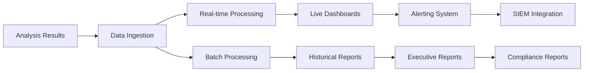

# Phase 3.5: Analytics & Reporting

## Advanced Analytics Engine and Enterprise Reporting

> **Timeline**: Months 12-13  
> **Prerequisites**: Phase 3.1, 3.2, 3.3, 3.4 Complete  
> **Goal**: Implement comprehensive analytics engine with enterprise reporting and SIEM integration

---

## 📊 **Analytics Engine Overview**

### **Analytics Architecture**

The analytics engine provides comprehensive security insights and enterprise reporting:

- **Real-Time Analytics**: Live security metrics and violation tracking
- **Historical Analysis**: Trend analysis and security evolution tracking
- **Predictive Analytics**: Risk assessment and security forecasting
- **Compliance Reporting**: Automated compliance report generation
- **Executive Dashboards**: C-level security visibility and KPIs

### **Data Processing Pipeline**



---

## 🧮 **Advanced Analytics Engine**

### **Analytics Processing System**

```typescript
// src/main/analytics/AnalyticsEngine.ts
import { EventEmitter } from 'events';
import Database from 'better-sqlite3';
import path from 'path';
import { app } from 'electron';

export interface AnalyticsDataPoint {
    id: string;
    timestamp: string;
    type: AnalyticsEventType;
    source: string;
    metadata: AnalyticsMetadata;
    metrics: AnalyticsMetrics;
    context: AnalyticsContext;
}

export interface AnalyticsMetrics {
    violationCounts: ViolationCountMetrics;
    performance: PerformanceMetrics;
    coverage: CoverageMetrics;
    quality: QualityMetrics;
    compliance: ComplianceMetrics;
}

export interface ViolationCountMetrics {
    critical: number;
    high: number;
    medium: number;
    low: number;
    total: number;
    byRule: Record<string, number>;
    byCategory: Record<string, number>;
}

export interface SecurityTrend {
    period: string;
    violationTrend: TrendData;
    complianceTrend: TrendData;
    qualityTrend: TrendData;
    riskScore: number;
    predictions: SecurityPrediction[];
}

export interface TrendData {
    current: number;
    previous: number;
    change: number;
    changePercent: number;
    direction: 'improving' | 'degrading' | 'stable';
}

export interface SecurityPrediction {
    metric: string;
    currentValue: number;
    predictedValue: number;
    confidence: number;
    timeframe: string;
    recommendation: string;
}

export interface ExecutiveSummary {
    organization: OrganizationInfo;
    period: ReportingPeriod;
    overview: SecurityOverview;
    keyMetrics: ExecutiveMetrics;
    riskAssessment: RiskAssessment;
    recommendations: ExecutiveRecommendation[];
    compliance: ComplianceStatus;
    trends: SecurityTrend[];
}

export interface SecurityOverview {
    totalAnalyses: number;
    totalViolations: number;
    riskScore: number;
    complianceScore: number;
    securityPosture: 'Excellent' | 'Good' | 'Fair' | 'Poor' | 'Critical';
    improvementFromLastPeriod: number;
}

export interface RiskAssessment {
    overallRisk: 'Low' | 'Medium' | 'High' | 'Critical';
    riskFactors: RiskFactor[];
    mitigationProgress: number;
    timeToRemediation: string;
    criticalFindings: CriticalFinding[];
}

export interface CriticalFinding {
    id: string;
    description: string;
    impact: string;
    likelihood: string;
    riskLevel: string;
    affectedSystems: string[];
    recommendedActions: string[];
    timeline: string;
}

export class AnalyticsEngine extends EventEmitter {
    private database: Database.Database;
    private realTimeProcessor: RealTimeProcessor;
    private batchProcessor: BatchProcessor;
    private trendAnalyzer: TrendAnalyzer;
    private predictiveEngine: PredictiveEngine;
    private reportGenerator: ReportGenerator;

    constructor() {
        super();
        
        const dbPath = path.join(app.getPath('userData'), 'analytics.db');
        this.database = new Database(dbPath);
        
        this.realTimeProcessor = new RealTimeProcessor(this.database);
        this.batchProcessor = new BatchProcessor(this.database);
        this.trendAnalyzer = new TrendAnalyzer(this.database);
        this.predictiveEngine = new PredictiveEngine();
        this.reportGenerator = new ReportGenerator(this.database);
    }

    async initialize(): Promise<void> {
        console.log('Initializing Analytics Engine...');

        // Create database schema
        await this.initializeDatabase();

        // Initialize processors
        await this.realTimeProcessor.initialize();
        await this.batchProcessor.initialize();
        await this.trendAnalyzer.initialize();
        await this.predictiveEngine.initialize();
        await this.reportGenerator.initialize();

        // Setup event listeners
        this.setupEventListeners();

        // Start background processors
        this.startBackgroundProcessing();

        console.log('Analytics Engine initialized');
        this.emit('initialized');
    }

    private async initializeDatabase(): Promise<void> {
        // Analytics data points table
        this.database.exec(`
            CREATE TABLE IF NOT EXISTS analytics_data (
                id TEXT PRIMARY KEY,
                timestamp TEXT NOT NULL,
                type TEXT NOT NULL,
                source TEXT NOT NULL,
                metadata TEXT NOT NULL,
                metrics TEXT NOT NULL,
                context TEXT NOT NULL,
                created_at DATETIME DEFAULT CURRENT_TIMESTAMP
            )
        `);

        // Aggregated metrics table
        this.database.exec(`
            CREATE TABLE IF NOT EXISTS aggregated_metrics (
                id TEXT PRIMARY KEY,
                period_type TEXT NOT NULL, -- hourly, daily, weekly, monthly
                period_start TEXT NOT NULL,
                period_end TEXT NOT NULL,
                metrics TEXT NOT NULL,
                created_at DATETIME DEFAULT CURRENT_TIMESTAMP
            )
        `);

        // Security trends table
        this.database.exec(`
            CREATE TABLE IF NOT EXISTS security_trends (
                id TEXT PRIMARY KEY,
                period TEXT NOT NULL,
                trend_data TEXT NOT NULL,
                risk_score REAL NOT NULL,
                predictions TEXT NOT NULL,
                created_at DATETIME DEFAULT CURRENT_TIMESTAMP
            )
        `);

        // Executive reports table
        this.database.exec(`
            CREATE TABLE IF NOT EXISTS executive_reports (
                id TEXT PRIMARY KEY,
                report_type TEXT NOT NULL,
                period_start TEXT NOT NULL,
                period_end TEXT NOT NULL,
                report_data TEXT NOT NULL,
                generated_at DATETIME DEFAULT CURRENT_TIMESTAMP,
                generated_by TEXT
            )
        `);

        // Create indexes for performance
        this.database.exec(`
            CREATE INDEX IF NOT EXISTS idx_analytics_timestamp ON analytics_data(timestamp);
            CREATE INDEX IF NOT EXISTS idx_analytics_type ON analytics_data(type);
            CREATE INDEX IF NOT EXISTS idx_analytics_source ON analytics_data(source);
            CREATE INDEX IF NOT EXISTS idx_aggregated_period ON aggregated_metrics(period_type, period_start);
            CREATE INDEX IF NOT EXISTS idx_trends_period ON security_trends(period);
            CREATE INDEX IF NOT EXISTS idx_reports_type_period ON executive_reports(report_type, period_start);
        `);
    }

    async ingestAnalysisResult(
        analysisResult: AnalysisResult,
        context: AnalysisContext
    ): Promise<void> {
        // Create analytics data point
        const dataPoint: AnalyticsDataPoint = {
            id: uuidv4(),
            timestamp: new Date().toISOString(),
            type: 'SecurityAnalysis',
            source: context.source || 'PowerShield',
            metadata: {
                analysisId: analysisResult.id,
                projectName: context.projectName,
                environment: context.environment,
                user: context.user,
                version: analysisResult.version
            },
            metrics: this.extractMetrics(analysisResult),
            context: {
                filesAnalyzed: analysisResult.filesAnalyzed,
                totalFiles: context.totalFiles,
                analysisDuration: analysisResult.duration,
                rulesExecuted: analysisResult.rulesExecuted,
                configuration: context.configuration
            }
        };

        // Store data point
        await this.storeDataPoint(dataPoint);

        // Process real-time analytics
        await this.realTimeProcessor.processDataPoint(dataPoint);

        // Emit event for live updates
        this.emit('data-ingested', dataPoint);

        console.log(`Analytics data ingested: ${dataPoint.id}`);
    }

    private extractMetrics(analysisResult: AnalysisResult): AnalyticsMetrics {
        const violations = analysisResult.violations || [];

        return {
            violationCounts: {
                critical: violations.filter(v => v.severity === 'Critical').length,
                high: violations.filter(v => v.severity === 'High').length,
                medium: violations.filter(v => v.severity === 'Medium').length,
                low: violations.filter(v => v.severity === 'Low').length,
                total: violations.length,
                byRule: this.countByRule(violations),
                byCategory: this.countByCategory(violations)
            },
            performance: {
                analysisDuration: analysisResult.duration || 0,
                filesPerSecond: (analysisResult.filesAnalyzed || 0) / ((analysisResult.duration || 1) / 1000),
                memoryUsage: analysisResult.memoryUsage || 0,
                cpuUsage: analysisResult.cpuUsage || 0
            },
            coverage: {
                filesAnalyzed: analysisResult.filesAnalyzed || 0,
                linesAnalyzed: analysisResult.linesAnalyzed || 0,
                rulesExecuted: analysisResult.rulesExecuted?.length || 0,
                coveragePercentage: this.calculateCoverage(analysisResult)
            },
            quality: {
                falsePositiveRate: analysisResult.falsePositiveRate || 0,
                truePositiveRate: analysisResult.truePositiveRate || 0,
                accuracyScore: analysisResult.accuracyScore || 0,
                confidenceScore: analysisResult.confidenceScore || 0
            },
            compliance: {
                complianceScore: analysisResult.complianceScore || 0,
                frameworksChecked: analysisResult.frameworksChecked?.length || 0,
                controlsPassed: analysisResult.controlsPassed || 0,
                controlsFailed: analysisResult.controlsFailed || 0
            }
        };
    }

    async generateSecurityTrend(
        timeRange: TimeRange,
        granularity: 'hourly' | 'daily' | 'weekly' | 'monthly' = 'daily'
    ): Promise<SecurityTrend> {
        console.log(`Generating security trend for ${timeRange.start} to ${timeRange.end}`);

        // Get aggregated data for the period
        const currentPeriodData = await this.getAggregatedMetrics(timeRange, granularity);
        
        // Get previous period for comparison
        const previousTimeRange = this.getPreviousPeriod(timeRange);
        const previousPeriodData = await this.getAggregatedMetrics(previousTimeRange, granularity);

        // Calculate trends
        const violationTrend = this.calculateTrend(
            currentPeriodData.totalViolations,
            previousPeriodData.totalViolations
        );

        const complianceTrend = this.calculateTrend(
            currentPeriodData.averageComplianceScore,
            previousPeriodData.averageComplianceScore
        );

        const qualityTrend = this.calculateTrend(
            currentPeriodData.averageQualityScore,
            previousPeriodData.averageQualityScore
        );

        // Calculate risk score
        const riskScore = this.calculateRiskScore(currentPeriodData);

        // Generate predictions
        const predictions = await this.predictiveEngine.generatePredictions(
            currentPeriodData,
            previousPeriodData,
            timeRange
        );

        const trend: SecurityTrend = {
            period: `${timeRange.start} to ${timeRange.end}`,
            violationTrend,
            complianceTrend,
            qualityTrend,
            riskScore,
            predictions
        };

        // Store trend data
        await this.storeTrendData(trend);

        return trend;
    }

    async generateExecutiveSummary(
        timeRange: TimeRange,
        organizationInfo: OrganizationInfo
    ): Promise<ExecutiveSummary> {
        console.log(`Generating executive summary for ${organizationInfo.name}`);

        // Get aggregated metrics for the period
        const metrics = await this.getAggregatedMetrics(timeRange, 'daily');

        // Calculate overview metrics
        const overview: SecurityOverview = {
            totalAnalyses: metrics.totalAnalyses,
            totalViolations: metrics.totalViolations,
            riskScore: this.calculateRiskScore(metrics),
            complianceScore: metrics.averageComplianceScore,
            securityPosture: this.determineSecurityPosture(metrics),
            improvementFromLastPeriod: await this.calculateImprovement(timeRange)
        };

        // Generate key metrics
        const keyMetrics: ExecutiveMetrics = {
            criticalViolations: metrics.criticalViolations,
            highViolations: metrics.highViolations,
            complianceScore: metrics.averageComplianceScore,
            riskScore: overview.riskScore,
            meanTimeToResolution: metrics.meanTimeToResolution,
            securityCoverage: metrics.averageCoverage,
            falsePositiveRate: metrics.averageFalsePositiveRate,
            automationEfficiency: metrics.automationEfficiency
        };

        // Generate risk assessment
        const riskAssessment = await this.generateRiskAssessment(metrics, timeRange);

        // Generate recommendations
        const recommendations = await this.generateExecutiveRecommendations(metrics, riskAssessment);

        // Get compliance status
        const compliance = await this.getComplianceStatus(timeRange);

        // Generate trends
        const trends = await this.generateTrendsForExecutive(timeRange);

        const summary: ExecutiveSummary = {
            organization: organizationInfo,
            period: {
                start: timeRange.start,
                end: timeRange.end,
                type: this.determinePeriodType(timeRange)
            },
            overview,
            keyMetrics,
            riskAssessment,
            recommendations,
            compliance,
            trends
        };

        // Store executive report
        await this.storeExecutiveReport(summary);

        this.emit('executive-summary-generated', summary);

        return summary;
    }

    async generateComplianceReport(
        framework: ComplianceFramework,
        timeRange: TimeRange
    ): Promise<ComplianceReport> {
        console.log(`Generating compliance report for ${framework.name} ${framework.version}`);

        const report: ComplianceReport = {
            id: uuidv4(),
            framework: framework,
            period: timeRange,
            generatedAt: new Date().toISOString(),
            overallScore: 0,
            controlResults: [],
            violations: [],
            recommendations: [],
            evidence: []
        };

        // Get compliance data for the framework
        const complianceData = await this.getComplianceData(framework, timeRange);

        // Evaluate each control
        for (const control of framework.controls) {
            const controlResult = await this.evaluateComplianceControl(
                control,
                complianceData,
                timeRange
            );

            report.controlResults.push(controlResult);

            // Add violations for failed controls
            if (controlResult.status === 'NonCompliant') {
                report.violations.push(...controlResult.violations);
            }
        }

        // Calculate overall score
        report.overallScore = this.calculateComplianceScore(report.controlResults);

        // Generate recommendations
        report.recommendations = await this.generateComplianceRecommendations(
            report.controlResults,
            framework
        );

        // Collect evidence
        report.evidence = await this.collectComplianceEvidence(
            framework,
            timeRange
        );

        // Store report
        await this.storeComplianceReport(report);

        this.emit('compliance-report-generated', report);

        return report;
    }

    async getRealtimeMetrics(): Promise<RealtimeMetrics> {
        const metrics = await this.realTimeProcessor.getCurrentMetrics();

        return {
            timestamp: new Date().toISOString(),
            activeAnalyses: metrics.activeAnalyses,
            violationsToday: metrics.violationsToday,
            complianceScore: metrics.currentComplianceScore,
            riskScore: metrics.currentRiskScore,
            systemHealth: metrics.systemHealth,
            alertsActive: metrics.activeAlerts,
            recentActivity: await this.getRecentActivity(10)
        };
    }

    async getHistoricalData(
        timeRange: TimeRange,
        granularity: 'hourly' | 'daily' | 'weekly' | 'monthly',
        metrics: string[]
    ): Promise<HistoricalDataPoint[]> {
        const query = `
            SELECT 
                period_start,
                period_end,
                metrics
            FROM aggregated_metrics 
            WHERE period_type = ? 
                AND period_start >= ? 
                AND period_end <= ?
            ORDER BY period_start ASC
        `;

        const rows = this.database.prepare(query).all(
            granularity,
            timeRange.start,
            timeRange.end
        );

        return rows.map(row => ({
            timestamp: row.period_start,
            period: `${row.period_start} to ${row.period_end}`,
            metrics: JSON.parse(row.metrics)
        }));
    }

    async exportAnalyticsData(
        timeRange: TimeRange,
        format: 'json' | 'csv' | 'xlsx',
        options: ExportOptions = {}
    ): Promise<ExportResult> {
        console.log(`Exporting analytics data as ${format}`);

        const exportId = uuidv4();
        const exportPath = path.join(
            app.getPath('userData'),
            'exports',
            `analytics-${exportId}.${format}`
        );

        try {
            // Get data for export
            const data = await this.getExportData(timeRange, options);

            // Export in requested format
            switch (format) {
                case 'json':
                    await this.exportAsJSON(data, exportPath);
                    break;
                case 'csv':
                    await this.exportAsCSV(data, exportPath);
                    break;
                case 'xlsx':
                    await this.exportAsExcel(data, exportPath);
                    break;
                default:
                    throw new Error(`Unsupported export format: ${format}`);
            }

            const result: ExportResult = {
                exportId,
                filePath: exportPath,
                format,
                size: await this.getFileSize(exportPath),
                recordCount: data.length,
                generatedAt: new Date().toISOString()
            };

            this.emit('data-exported', result);

            return result;

        } catch (error) {
            console.error('Analytics export failed:', error);
            throw new Error(`Export failed: ${error.message}`);
        }
    }

    private calculateTrend(current: number, previous: number): TrendData {
        const change = current - previous;
        const changePercent = previous > 0 ? (change / previous) * 100 : 0;
        
        let direction: 'improving' | 'degrading' | 'stable';
        if (Math.abs(changePercent) < 5) {
            direction = 'stable';
        } else if (changePercent < 0) {
            direction = 'improving'; // Fewer violations is better
        } else {
            direction = 'degrading';
        }

        return {
            current,
            previous,
            change,
            changePercent,
            direction
        };
    }

    private calculateRiskScore(metrics: AggregatedMetrics): number {
        // Risk score calculation based on multiple factors
        const violationWeight = 0.4;
        const complianceWeight = 0.3;
        const qualityWeight = 0.2;
        const trendWeight = 0.1;

        const violationScore = Math.min(100, (metrics.totalViolations / metrics.totalAnalyses) * 10);
        const complianceScore = 100 - metrics.averageComplianceScore;
        const qualityScore = 100 - metrics.averageQualityScore;
        const trendScore = metrics.negativetrends * 20;

        const riskScore = (
            violationScore * violationWeight +
            complianceScore * complianceWeight +
            qualityScore * qualityWeight +
            trendScore * trendWeight
        );

        return Math.min(100, Math.max(0, riskScore));
    }

    // Additional implementation methods...
}
```

---

## 📈 **SIEM Integration System**

### **SIEM Connector Service**

```typescript
// src/main/analytics/SIEMIntegration.ts
export interface SIEMConnector {
    name: string;
    type: SIEMType;
    configuration: SIEMConfiguration;
    status: 'connected' | 'disconnected' | 'error';
    lastSync: string;
}

export interface SIEMEvent {
    id: string;
    timestamp: string;
    source: string;
    severity: 'Critical' | 'High' | 'Medium' | 'Low' | 'Info';
    category: string;
    title: string;
    description: string;
    metadata: Record<string, any>;
    indicators: SecurityIndicator[];
}

export interface SecurityIndicator {
    type: 'hash' | 'ip' | 'domain' | 'file' | 'command' | 'user';
    value: string;
    confidence: number;
    context: string;
}

export class SIEMIntegrationService extends EventEmitter {
    private connectors: Map<string, SIEMConnector> = new Map();
    private eventQueue: SIEMEvent[] = [];
    private batchProcessor: SIEMBatchProcessor;

    constructor() {
        super();
        this.batchProcessor = new SIEMBatchProcessor();
    }

    async initialize(): Promise<void> {
        console.log('Initializing SIEM Integration Service...');

        await this.loadSIEMConnectors();
        await this.batchProcessor.initialize();

        // Start periodic sync
        this.startPeriodicSync();

        console.log(`SIEM Integration initialized with ${this.connectors.size} connectors`);
    }

    async sendSecurityEvent(
        analysisResult: AnalysisResult,
        context: AnalysisContext
    ): Promise<void> {
        // Convert analysis result to SIEM events
        const events = this.convertToSIEMEvents(analysisResult, context);

        for (const event of events) {
            await this.queueEvent(event);
        }

        // Process queue if threshold reached
        if (this.eventQueue.length >= 10) {
            await this.processBatch();
        }
    }

    private convertToSIEMEvents(
        analysisResult: AnalysisResult,
        context: AnalysisContext
    ): SIEMEvent[] {
        const events: SIEMEvent[] = [];

        // Create events for each violation
        for (const violation of analysisResult.violations) {
            const event: SIEMEvent = {
                id: uuidv4(),
                timestamp: new Date().toISOString(),
                source: 'PowerShield',
                severity: violation.severity as any,
                category: 'Security.Code.Analysis',
                title: `PowerShell Security Violation: ${violation.rule}`,
                description: violation.description,
                metadata: {
                    ruleId: violation.rule,
                    filePath: violation.file,
                    lineNumber: violation.line,
                    column: violation.column,
                    project: context.projectName,
                    environment: context.environment,
                    analysisId: analysisResult.id
                },
                indicators: this.extractIndicators(violation)
            };

            events.push(event);
        }

        // Create summary event for the analysis
        if (analysisResult.violations.length > 0) {
            const summaryEvent: SIEMEvent = {
                id: uuidv4(),
                timestamp: new Date().toISOString(),
                source: 'PowerShield',
                severity: this.determineSummarySeverity(analysisResult.violations),
                category: 'Security.Analysis.Summary',
                title: 'PowerShell Security Analysis Completed',
                description: `Analysis completed with ${analysisResult.violations.length} violations found`,
                metadata: {
                    analysisId: analysisResult.id,
                    totalViolations: analysisResult.violations.length,
                    criticalCount: analysisResult.violations.filter(v => v.severity === 'Critical').length,
                    highCount: analysisResult.violations.filter(v => v.severity === 'High').length,
                    filesAnalyzed: analysisResult.filesAnalyzed,
                    duration: analysisResult.duration,
                    project: context.projectName,
                    environment: context.environment
                },
                indicators: []
            };

            events.push(summaryEvent);
        }

        return events;
    }

    // Additional implementation methods for different SIEM platforms...
}
```

---

## 📊 **Executive Dashboard System**

### **Dashboard Service**

```typescript
// src/main/analytics/DashboardService.ts
export interface DashboardWidget {
    id: string;
    type: WidgetType;
    title: string;
    configuration: WidgetConfiguration;
    dataSource: DataSourceConfiguration;
    layout: WidgetLayout;
    permissions: WidgetPermissions;
}

export interface ExecutiveDashboard {
    id: string;
    name: string;
    description: string;
    widgets: DashboardWidget[];
    layout: DashboardLayout;
    audience: 'executive' | 'manager' | 'analyst' | 'developer';
    autoRefresh: boolean;
    refreshInterval: number;
}

export class DashboardService extends EventEmitter {
    private dashboards: Map<string, ExecutiveDashboard> = new Map();
    private widgetRegistry: WidgetRegistry;
    private dataService: DashboardDataService;

    constructor() {
        super();
        this.widgetRegistry = new WidgetRegistry();
        this.dataService = new DashboardDataService();
    }

    async initialize(): Promise<void> {
        console.log('Initializing Dashboard Service...');

        await this.dataService.initialize();
        await this.loadDashboards();
        await this.registerBuiltInWidgets();

        console.log(`Dashboard Service initialized with ${this.dashboards.size} dashboards`);
    }

    private async registerBuiltInWidgets(): Promise<void> {
        // Security Overview Widget
        this.widgetRegistry.register({
            type: 'security-overview',
            name: 'Security Overview',
            description: 'High-level security metrics and status',
            dataQuery: async (timeRange: TimeRange) => {
                return await this.dataService.getSecurityOverview(timeRange);
            },
            renderer: 'MetricsGrid'
        });

        // Violation Trends Widget
        this.widgetRegistry.register({
            type: 'violation-trends',
            name: 'Violation Trends',
            description: 'Security violation trends over time',
            dataQuery: async (timeRange: TimeRange) => {
                return await this.dataService.getViolationTrends(timeRange);
            },
            renderer: 'LineChart'
        });

        // Compliance Status Widget
        this.widgetRegistry.register({
            type: 'compliance-status',
            name: 'Compliance Status',
            description: 'Compliance framework status and scores',
            dataQuery: async (timeRange: TimeRange) => {
                return await this.dataService.getComplianceStatus(timeRange);
            },
            renderer: 'ComplianceGrid'
        });

        // Risk Assessment Widget
        this.widgetRegistry.register({
            type: 'risk-assessment',
            name: 'Risk Assessment',
            description: 'Current risk score and assessment',
            dataQuery: async (timeRange: TimeRange) => {
                return await this.dataService.getRiskAssessment(timeRange);
            },
            renderer: 'RiskGauge'
        });

        // Top Violations Widget
        this.widgetRegistry.register({
            type: 'top-violations',
            name: 'Top Violations',
            description: 'Most common security violations',
            dataQuery: async (timeRange: TimeRange) => {
                return await this.dataService.getTopViolations(timeRange);
            },
            renderer: 'BarChart'
        });
    }

    async createExecutiveDashboard(): Promise<ExecutiveDashboard> {
        const dashboard: ExecutiveDashboard = {
            id: 'executive-security-dashboard',
            name: 'Executive Security Dashboard',
            description: 'High-level security overview for executives',
            audience: 'executive',
            autoRefresh: true,
            refreshInterval: 300000, // 5 minutes
            layout: {
                columns: 12,
                rows: 8,
                margin: 10
            },
            widgets: [
                {
                    id: 'security-overview',
                    type: 'security-overview',
                    title: 'Security Overview',
                    configuration: {
                        timeRange: '30d',
                        metrics: ['riskScore', 'complianceScore', 'totalViolations', 'criticalViolations']
                    },
                    dataSource: {
                        type: 'analytics',
                        parameters: { aggregation: 'summary' }
                    },
                    layout: {
                        x: 0, y: 0, w: 12, h: 2
                    },
                    permissions: {
                        view: ['executive', 'manager'],
                        edit: ['admin']
                    }
                },
                {
                    id: 'violation-trends',
                    type: 'violation-trends',
                    title: 'Security Trends (30 Days)',
                    configuration: {
                        timeRange: '30d',
                        granularity: 'daily',
                        metrics: ['critical', 'high', 'medium', 'low']
                    },
                    dataSource: {
                        type: 'analytics',
                        parameters: { aggregation: 'trends' }
                    },
                    layout: {
                        x: 0, y: 2, w: 8, h: 3
                    },
                    permissions: {
                        view: ['executive', 'manager', 'analyst'],
                        edit: ['admin']
                    }
                },
                {
                    id: 'compliance-status',
                    type: 'compliance-status',
                    title: 'Compliance Status',
                    configuration: {
                        frameworks: ['NIST', 'CIS', 'SOC2'],
                        showTrends: true
                    },
                    dataSource: {
                        type: 'compliance',
                        parameters: { includeHistory: true }
                    },
                    layout: {
                        x: 8, y: 2, w: 4, h: 3
                    },
                    permissions: {
                        view: ['executive', 'manager', 'compliance'],
                        edit: ['admin']
                    }
                },
                {
                    id: 'risk-assessment',
                    type: 'risk-assessment',
                    title: 'Current Risk Assessment',
                    configuration: {
                        showPredictions: true,
                        includeMitigation: true
                    },
                    dataSource: {
                        type: 'risk',
                        parameters: { includeFactors: true }
                    },
                    layout: {
                        x: 0, y: 5, w: 6, h: 3
                    },
                    permissions: {
                        view: ['executive', 'manager', 'analyst'],
                        edit: ['admin']
                    }
                },
                {
                    id: 'top-violations',
                    type: 'top-violations',
                    title: 'Top Security Issues',
                    configuration: {
                        limit: 10,
                        timeRange: '7d'
                    },
                    dataSource: {
                        type: 'violations',
                        parameters: { groupBy: 'rule', orderBy: 'count' }
                    },
                    layout: {
                        x: 6, y: 5, w: 6, h: 3
                    },
                    permissions: {
                        view: ['executive', 'manager', 'analyst', 'developer'],
                        edit: ['admin']
                    }
                }
            ]
        };

        this.dashboards.set(dashboard.id, dashboard);
        await this.saveDashboard(dashboard);

        return dashboard;
    }

    async generateWidgetData(
        widget: DashboardWidget,
        timeRange: TimeRange
    ): Promise<WidgetData> {
        const widgetDefinition = this.widgetRegistry.get(widget.type);
        if (!widgetDefinition) {
            throw new Error(`Unknown widget type: ${widget.type}`);
        }

        try {
            const data = await widgetDefinition.dataQuery(timeRange);
            
            return {
                widgetId: widget.id,
                type: widget.type,
                data,
                generatedAt: new Date().toISOString(),
                timeRange,
                status: 'success'
            };
        } catch (error) {
            console.error(`Failed to generate data for widget ${widget.id}:`, error);
            
            return {
                widgetId: widget.id,
                type: widget.type,
                data: null,
                generatedAt: new Date().toISOString(),
                timeRange,
                status: 'error',
                error: error.message
            };
        }
    }

    // Additional implementation methods...
}
```

---

## 📋 **Implementation Checklist**

### **Phase 3.5.1: Analytics Engine (Week 1)**

- [ ] Implement AnalyticsEngine class
- [ ] Create SQLite analytics database
- [ ] Add real-time data processing
- [ ] Implement trend analysis algorithms
- [ ] Create predictive analytics engine

### **Phase 3.5.2: Executive Reporting (Week 2)**

- [ ] Implement ReportGenerator service
- [ ] Create executive summary templates
- [ ] Add compliance reporting system
- [ ] Implement risk assessment engine
- [ ] Create automated report scheduling

### **Phase 3.5.3: SIEM Integration (Week 3)**

- [ ] Implement SIEMIntegrationService
- [ ] Add support for major SIEM platforms
- [ ] Create security event formatting
- [ ] Implement batch processing
- [ ] Add real-time event streaming

### **Phase 3.5.4: Dashboard System (Week 4)**

- [ ] Implement DashboardService
- [ ] Create executive dashboard widgets
- [ ] Add real-time data visualization
- [ ] Implement custom dashboard builder
- [ ] Create mobile-responsive layouts

### **Phase 3.5.5: Data Export & API (Week 5)**

- [ ] Implement data export functionality
- [ ] Create REST API for analytics data
- [ ] Add webhook notifications
- [ ] Implement data retention policies
- [ ] Create backup and recovery system

### **Phase 3.5.6: Integration & Testing (Week 6-7)**

- [ ] Integrate with main application
- [ ] Test analytics data pipeline
- [ ] Validate report generation
- [ ] Test SIEM integrations
- [ ] Performance optimization

### **Phase 3.5.7: Documentation & Training (Week 8)**

- [ ] Create analytics user guide
- [ ] Add dashboard configuration docs
- [ ] Create SIEM integration guides
- [ ] Develop admin training materials
- [ ] Add troubleshooting documentation

---

## 🔍 **Advanced Analytics Features**

### **Machine Learning Capabilities**

1. **Anomaly Detection**: Identify unusual security patterns
2. **Predictive Modeling**: Forecast security trends and risks
3. **Classification**: Automatically categorize security violations
4. **Clustering**: Group similar security issues for analysis
5. **Recommendation Engine**: Suggest remediation priorities

### **Data Visualization**

1. **Interactive Charts**: Real-time security metrics visualization
2. **Heat Maps**: Security violation distribution across projects
3. **Network Graphs**: Dependency and impact analysis
4. **Geospatial Views**: Security metrics by geographic location
5. **Timeline Views**: Security evolution over time

### **Export & Integration**

1. **Multiple Formats**: JSON, CSV, Excel, PDF reports
2. **API Access**: RESTful API for external integrations
3. **Webhook Notifications**: Real-time security event alerts
4. **Scheduled Reports**: Automated report generation and distribution
5. **Data Archival**: Long-term data retention and compliance

---

## 📊 **Success Metrics**

### **Analytics Metrics**

- **Data Processing**: > 10,000 analysis results per hour
- **Query Performance**: < 500ms average query response time
- **Prediction Accuracy**: > 85% accuracy for security trend predictions
- **Report Generation**: < 30 seconds for standard executive reports

### **User Adoption Metrics**

- **Dashboard Usage**: > 80% of executives actively using dashboards
- **Report Consumption**: > 90% of scheduled reports opened within 24 hours
- **Export Utilization**: > 60% of teams using data export features
- **API Usage**: > 100 API calls per day for integrations

### **Business Impact Metrics**

- **Decision Speed**: 50% faster security decision-making
- **Compliance Efficiency**: 75% reduction in compliance reporting time
- **Risk Visibility**: 100% real-time visibility into security risks
- **Cost Reduction**: 40% reduction in manual reporting effort

---

**Phase 3 Complete**: All enterprise analytics and reporting capabilities implemented

---

*This analytics and reporting implementation provides the comprehensive insights and enterprise visibility required for large-scale PowerShell security management.*
