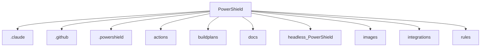

# PowerShield

     

*Documentation generated by AccuDoc on 2025-11-15 10:53:42*

---


<a name="overview"></a>
## Overview

### Existing Documentation

# PowerShield - Comprehensive PowerShell Security Platform


[](https://github.com/J-Ellette/PowerShield/actions/workflows/powershell-security.yml)

  

  

**PowerShield** is a compr...

*(Truncated for brevity)*

### Repository Information

- **Repository URL:** https://github.com/J-Ellette/PowerShield.git
- **Current Branch:** main
- **Branches:** 1 (main)
- **Last Commit:** f510a8261a242a0b545173e2c24ee44f9487fae0 Initial commit

<a name="features"></a>
## Features

- Multi-language support: Shell, TypeScript, JavaScript
- Build automation with Docker, GitHub Actions
- Comprehensive documentation (49 files)

<a name="technology-stack"></a>
## Technology Stack

### Programming Languages

- **TypeScript**: 31 files
- **Shell**: 2 files
- **JavaScript**: 1 files

### Build Tools & CI/CD

- Docker
- GitHub Actions

<a name="architecture"></a>
## Architecture

### Project Structure Overview



**Directory Structure:**

```
PowerShield/
├── .claude/
├── .github/
├── .powershield/
├── actions/
├── buildplans/
├── docs/
├── headless_PowerShield/
├── images/
├── integrations/
├── rules/
├── scripts/
├── src/
├── tests/
├── tools/
├── vscode-extension/
```

<a name="installation"></a>
## Installation

*Installation instructions will be added as the project develops.*

<a name="usage"></a>
## Usage

### Running the Application


For Node.js projects:
```bash
node index.js
```
*or*
```bash
npm start
```

<a name="configuration-files"></a>
## Configuration Files

The project uses the following configuration files:


### JSON Files

- `.claude\settings.local.json`
  - Configuration keys: permissions
- `actions\copilot-autofix\package-lock.json`
  - Configuration keys: name, version, lockfileVersion, requires, packages
- `actions\copilot-autofix\package.json`
  - Configuration keys: name, version, description, main, scripts
  - ...and 5 more
- `actions\copilot-autofix\tsconfig.json`
  - Configuration keys: compilerOptions, include, exclude
- `integrations\azure-devops\task.json`
  - Configuration keys: $schema, id, name, friendlyName, description
  - ...and 7 more
- `vscode-extension\package-lock.json`
- `vscode-extension\package.json`
  - Configuration keys: name, displayName, description, version, publisher
  - ...and 14 more
- `vscode-extension\tsconfig.json`
  - Configuration keys: compilerOptions, include, exclude

### YAML Files

- `.powershield.secure.yml`
- `.powershield.yml`
- `action.yml`
- `.github\secret_scanning.yml`
- `.github\workflows\powershell-security.yml`
- `docs\examples\enterprise-workflow.yml`
- `integrations\azure-devops\azure-pipelines.yml`
- `integrations\circleci\config.yml`
- `integrations\gitlab\.gitlab-ci.yml`
- `rules\community\clear-host-detection.yml`

<a name="environment-variables"></a>
## Environment Variables

The following environment variables are used by this project:


### Used Variables

These variables are referenced in the code:

- `ANTHROPIC_API_KEY` (used in `actions\copilot-autofix\src\ai-providers.ts`)
- `AZURE_OPENAI_API_KEY` (used in `vscode-extension\src\ai\AzureOpenAIProvider.ts`)
- `AZURE_OPENAI_DEPLOYMENT` (used in `actions\copilot-autofix\src\ai-providers.ts`)
- `AZURE_OPENAI_ENDPOINT` (used in `actions\copilot-autofix\src\ai-providers.ts`)
- `AZURE_OPENAI_KEY` (used in `actions\copilot-autofix\src\ai-providers.ts`)
- `ERROR_HANDLING` (used in `vscode-extension\verify-phase-2.5.sh`)
- `GITHUB_TOKEN` (used in `vscode-extension\src\ai\GitHubModelsProvider.ts`)
- `GITHUB_WORKSPACE` (used in `actions\copilot-autofix\src\index.ts`)
- `GREEN` (used in `vscode-extension\verify-phase-2.5.sh`)
- `HOME` (used in `actions\copilot-autofix\src\config.ts`)
- `NC` (used in `vscode-extension\verify-phase-2.5.sh`)
- `OPENAI_API_KEY` (used in `actions\copilot-autofix\src\ai-providers.ts`)
- `RED` (used in `vscode-extension\verify-phase-2.5.sh`)
- `SIZE` (used in `vscode-extension\verify-phase-2.5.sh`)
- `USERPROFILE` (used in `actions\copilot-autofix\src\config.ts`)
- `YELLOW` (used in `vscode-extension\verify-phase-2.5.sh`)

<a name="type-information"></a>
## Type Information

The project uses static typing:


### TypeScript Interfaces

Found 20 interfaces:

- `AIProviderMessage` in `actions\copilot-autofix\src\ai-providers.ts`
- `AIProviderResponse` in `actions\copilot-autofix\src\ai-providers.ts`
- `FixRequest` in `actions\copilot-autofix\src\ai-providers.ts`
- `FixResponse` in `actions\copilot-autofix\src\ai-providers.ts`
- `AnalysisConfig` in `actions\copilot-autofix\src\config.ts`
- `RuleConfig` in `actions\copilot-autofix\src\config.ts`
- `AutoFixConfig` in `actions\copilot-autofix\src\config.ts`
- `SuppressionConfig` in `actions\copilot-autofix\src\config.ts`
- `ReportingConfig` in `actions\copilot-autofix\src\config.ts`
- `CIConfig` in `actions\copilot-autofix\src\config.ts`
- *...and 10 more*

<a name="import-analysis"></a>
## Import Analysis

Analysis of module and package imports:


### Javascript Imports

Most frequently imported modules:

- `: ` (1 times)
- `fs` (1 times)

<a name="code-examples"></a>
## Code Examples

The repository includes the following code examples:

### README.md - yaml example

*Location: `docs\examples\README.md`*

Code example from documentation

```yaml
# .powershield.yml
version: "1.0"

analysis:
  severity_threshold: "Medium"

webhooks:
  - url: "https://hooks.slack.com/services/YOUR/WEBHOOK/URL"
    format: "Slack"
    events: ["critical_found"]
    severity_filter: ["Critical"]
```

### README.md - yaml example

*Location: `docs\examples\README.md`*

Code example from documentation

```yaml
# .powershield.yml
version: "1.0"

analysis:
  severity_threshold: "Medium"
  parallel_analysis: true
  exclude_paths:
    - "**/node_modules/**"
    - "**/dist/**"

# Webhook notifications
webhooks:
  # Slack for dev team
  - url: "https://hooks.slack.com/services/YOUR/DEV/WEBHOOK"
    format: "Sla...
```

### README.md - yaml example

*Location: `docs\examples\README.md`*

Code example from documentation

```yaml
webhooks:
  - url: "https://hooks.slack.com/services/YOUR/WEBHOOK/URL"
    format: "Slack"
    events: ["critical_found"]
    severity_filter: ["Critical"]
```


<a name="project-structure"></a>
## Project Structure

```
├── .claude\settings.local.json
├── .dockerignore
├── .gitattributes
├── .github\copilot-instructions.md
├── .github\secret_scanning.yml
├── .github\workflows\powershell-security.yml
├── .gitignore
├── .powershield.secure.yml
├── .powershield.yml
├── .powershield.yml.example
├── .powershield\hooks\pre-commit
├── .powershieldignore
├── Dockerfile
├── LICENSE
├── PHASE_2.4_FINAL_REPORT.md
├── README-FIXES.md
├── README.md
├── action.yml
├── actions\copilot-autofix\.gitignore
├── actions\copilot-autofix\package-lock.json
├── actions\copilot-autofix\package.json
├── actions\copilot-autofix\src\ai-providers.ts
├── actions\copilot-autofix\src\config.ts
├── actions\copilot-autofix\src\index-old.ts
├── actions\copilot-autofix\src\index.ts
├── actions\copilot-autofix\tsconfig.json
├── buildplans\PowerShieldSecuritySuite.md
├── buildplans\SoftwarePlan\Phase_1_GitHub_Workflow_Implementation.md
├── buildplans\SoftwarePlan\Phase_2_VS_Code_Extension_Implementation.md
├── buildplans\SoftwarePlan\Phase_3_Standalone_Sandbox_Application.md
├── buildplans\TechnicalPlan.md
├── buildplans\detailed-component-roadmaps.md
├── buildplans\phase-1-master-plan.md
├── buildplans\phase-2-master-plan.md
├── buildplans\phase-3-0-master-plan.md
├── buildplans\phase-3-1-electron-foundation.md
├── buildplans\phase-3-2-docker-sandbox.md
├── buildplans\phase-3-3-local-ai.md
├── buildplans\phase-3-4-enterprise-governance.md
├── buildplans\phase-3-5-analytics-reporting.md
├── docs\ADVANCED_ATTACK_DETECTION.md
├── docs\ADVANCED_SECRET_DETECTION.md
├── docs\AI_AUTOFIX_GUIDE.md
├── docs\BASELINE_GUIDE.md
├── docs\CI_CD_INTEGRATION.md
├── docs\CLI_USAGE_GUIDE.md
├── docs\COMPLIANCE_FRAMEWORKS.md
├── docs\CONFIGURATION_GUIDE.md
├── docs\ENTERPRISE_ADOPTION_PLAYBOOK.md
└── docs\Enhanced-SARIF-Output.md

... and 216 more files
```

### Key Documentation Files

- `LICENSE`
- `README-FIXES.md`
- `README.md`
- `docs\ADVANCED_ATTACK_DETECTION.md`
- `docs\ADVANCED_SECRET_DETECTION.md`
- `docs\AI_AUTOFIX_GUIDE.md`
- `docs\BASELINE_GUIDE.md`
- `docs\CI_CD_INTEGRATION.md`
- `docs\CLI_USAGE_GUIDE.md`
- `docs\COMPLIANCE_FRAMEWORKS.md`

<a name="code-statistics"></a>
## Code Statistics

### Overall Statistics

- **Total Lines:** 9,553
- **Code Lines:** 6,864
- **Comment Lines:** 1,461
- **Blank Lines:** 1,228
- **Files Analyzed:** 32

**Code Distribution:**
- Code: 71.9%
- Comments: 15.3%
- Blank: 12.9%

### Statistics by Language

| Language | Files | Total Lines | Code Lines | Comment Lines |
|----------|-------|-------------|------------|---------------|
| JavaScript | 32 | 9,553 | 6,864 | 1,461 |

<a name="development-notes"></a>
## Development Notes

The following TODO items and notes were found in the codebase:


### TODO (2)

- `vscode-extension\src\ai\TemplateBasedProvider.ts:142` - Replace with specific cmdlet or validated parameter
- `vscode-extension\src\performance\analysis-worker.ts:73` - Implement actual PowerShell analysis

<a name="changelog"></a>
## Changelog

Recent changes to this repository:


### 2025-11-15

- **f510a82** Initial commit (*Heathen-Volholl*)

<a name="contributors"></a>
## Contributors

Thank you to all the contributors who have helped build this project:

- **Heathen-Volholl** (1 commits)

<a name="license"></a>
## License

This project is licensed under the **MIT License**.

---

*This documentation was automatically generated by [AccuDoc](https://github.com/jamesellette/AccuDoc).*

*Please verify all information and update as needed.*